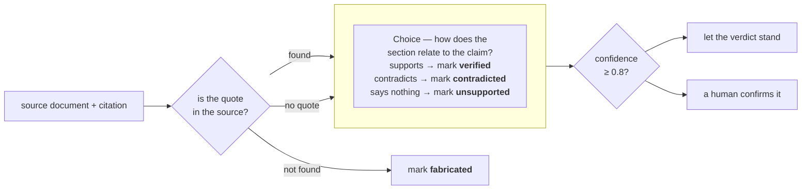

> 对照源文档做检查，抓住错误或凭空捏造的引用。一道 TypeSafe 的 `Choice` 问题判定引文的上下文是否支持该论断，而它的 `confidence` 可以把这条引用标出来交给人工复核。

一个大语言模型回答问题并附上引用：对每条论断，给出来源文档中的某一节，以及该论断所依据的引文。

其中有些引用是错的或凭空捏造的：引文可能根本不在文档里，也可能逐字都在，但它所在的上下文说的恰恰与论断相反。

人工核对一条很慢：找到文档、在文档里找到引文，然后把它周围的上下文读得够多，才能判断它到底支不支持这条论断。

为了自动完成这项检查，我们先用普通的字符串匹配找出缺失的引文，然后用一道 `Choice` 问题去读每一条存活下来的引文的上下文，判断它是否支持论断。



下面把某份关于 RFC 7519（JSON Web Token）的 LLM 答案里的八条引用送进检查。四条准确的引用以 0.93 或更高的 `confidence` 返回 `verified`。

四条植入的失败全部被抓出：一条捏造的引文、一条被反驳的论断，以及两条被送去人工处理的「无支持」引用。

`check_citation()` 就是你在这里要构建的函数，它接收一份源文档和一条引用，返回四种结论之一：`verified`、`unsupported`、`contradicted` 或 `fabricated`。它还会返回一个 `confidence`，用来标出应该让人看一眼的那些。

## 环境准备

```bash
pip install ipython "typesafe-sdk>=0.5.7" cooksafe --extra-index-url https://pypi.typesafe.ai/
```

然后设置 `TYPESAFE_API_KEY`。每次 API 调用都缓存在 `json_cache.json` 里，该文件随 cookbook 一起提供，所以重新运行会重放已发布的数字，而不是调用 API。删掉该文件即可全部实时运行。

下面的数字来自 2026-08-16 的 `jev-1.12`。

```python
import json
import os
import re
from pathlib import Path
from time import perf_counter

from cooksafe import JsonCache, make_playground_link
from IPython.display import Markdown, display
from typesafe_sdk import Choice, TypeSafeClient

TYPESAFE_MODEL = "jev-1.12"
AUTO_ACCEPT = 0.8  # start high for more human review as you build trust in the model

client = TypeSafeClient(
    api_key=os.environ.get("TYPESAFE_API_KEY", "cache-only"),
    base_url=os.environ.get("TYPESAFE_ENDPOINT"),
    timeout=120.0,
)
json_cache = JsonCache(Path("json_cache.json"))
```

## 加载源文档与引用

源文档是 [RFC 7519](https://www.rfc-editor.org/rfc/rfc7519.html)（JSON Web Token），从 rfc-editor.org 取回，随本 cookbook 一起提交为 `rfc7519.txt`。

下面的代码先剥掉页眉页脚，再把文本切成分节的章节。

`citations.json` 里的八条引用由某个 LLM 针对这份 RFC 写出。四条是准确的；另外四条我们动过手脚，让它们通不过检查。

```python
def load_source() -> str:
    """RFC 7519 verbatim, minus the page headers and footers that interrupt its paragraphs."""
    lines = []
    for line in Path("rfc7519.txt").read_text().splitlines():
        bare = line.lstrip("\f")
        if re.match(r"Jones, et al\.\s.*\[Page \d+\]$", bare):
            continue
        if re.match(r"RFC 7519\s+JSON Web Token \(JWT\)\s+May 2015$", bare):
            continue
        lines.append(bare)
    return re.sub(r"\n{3,}", "\n\n", "\n".join(lines))

def split_sections(source: str) -> dict[str, str]:
    """Map each numbered section ("4.1.3") to its text, split on the RFC's header lines."""
    boundary = re.compile(r"(?m)^(?:(\d+(?:\.\d+)*)\.  .+|Appendix [A-Z]\..*)$")
    marks = list(boundary.finditer(source))
    sections = {}
    for mark, nxt in zip(marks, marks[1:] + [None]):
        if mark.group(1) is None:  # an appendix header only terminates the section before it
            continue
        sections[mark.group(1)] = source[mark.start() : nxt.start() if nxt else len(source)].strip()
    return sections

SOURCE = load_source()
SECTIONS = split_sections(SOURCE)
CITATIONS = json.loads(Path("citations.json").read_text())

print(f"{len(SOURCE):,} characters, {len(SECTIONS)} numbered sections, {len(CITATIONS)} citations")
print("\nA citation with a quote:")
print(json.dumps(CITATIONS[1], indent=2))
print("\nA claim-only citation:")
print(json.dumps(next(c for c in CITATIONS if c["quote"] is None), indent=2))
```

```text
58,365 characters, 45 numbered sections, 8 citations

A citation with a quote:
{
  "id": "aud_reject",
  "claim": "If a validator does not find itself in a token's audience list, it has to reject the token.",
  "quote": "If the principal processing the claim does not identify itself with a value in the \"aud\" claim when this claim is present, then the JWT MUST be rejected.",
  "section": "4.1.3"
}

A claim-only citation:
{
  "id": "iat_future",
  "claim": "The \"iat\" claim requires validators to reject tokens whose issue time is in the future.",
  "quote": null,
  "section": "4.1.6"
}
```

## 在源文档里定位每条引文

不在源文档里的引文就是捏造的，找出这一点不需要任何模型。先把空白与弯引号归一化，好让引文能跨过 RFC 的换行仍然匹配，然后把它当子串查找。

匹配成功还会告诉你这条引文来自哪一节，而那一节就是下一步交给模型去读的文本。

一条引用可以只点名某一节而不引用其中任何文字。这种情况下没有东西可以匹配，所以直接取该引用点名的那一节，进入模型环节。

```python
def normalize(text: str) -> str:
    """Collapse whitespace and fold curly quotes, so a quote matches across line wraps."""
    table = str.maketrans({"“": '"', "”": '"', "‘": "'", "’": "'"})
    return re.sub(r"\s+", " ", text.translate(table)).strip()

def find_quote(sections: dict[str, str], quote: str) -> str | None:
    """The number of the section that contains the quote verbatim, or None."""
    needle = normalize(quote)
    for number in sorted(sections, key=lambda n: [int(p) for p in n.split(".")]):
        if needle in normalize(sections[number]):
            return number
    return None

def locate(sections: dict[str, str], citation: dict) -> tuple[str, str | None]:
    """Step 1 for one citation: a status, plus the section step 2 will read."""
    if citation["quote"] is None:
        return "section-only", sections[citation["section"]]
    number = find_quote(sections, citation["quote"])
    if number is None:
        return "missing", None
    return "found", sections[number]

for citation in CITATIONS:
    status, section = locate(SECTIONS, citation)
    where = f"section of {len(section):,} chars" if section else "not in the source"
    print(f"{citation['id']:<18}{status:<14}{where}")
```

```text
epoch_seconds     found         section of 3,122 chars
aud_reject        found         section of 761 chars
sig_reporting     missing       not in the source
clock_skew        found         section of 529 chars
exp_required      found         section of 529 chars
pii_encryption    found         section of 1,653 chars
iat_future        section-only  section of 270 chars
duplicate_names   found         section of 918 chars
```

## 验证源文档是否支持该论断

到这里仍然带着引文的引用，已经逐字匹配上了源文档。这还不够：引文可能准确，而建立在它之上的论断仍然是错的。要判断这一点，得看引文所在的上下文，也就是第一步找到的那一节。

每条存活下来的引用对应一道 `Choice` 问题，覆盖一节与论断之间三种可能的关系。概率最高的那个选项就是结论，而 `AUTO_ACCEPT`（上面代码里的 0.8）决定它接下来怎么处理：

- `confidence` 达到或高于 0.8：结论直接生效；
- 低于 0.8：由人工确认结论，之后才有人据此行动。

一开始把阈值调高，等你看到模型在你自己文档上的表现后再逐步下调。

```python
QUESTIONS = {
    "relation": Choice(
        instructions="How does the section relate to the claim?",
        criteria={
            "supports": "The section states the claim or directly implies that it is true",
            "contradicts": "The section states the opposite of the claim or implies it is false",
            "says_nothing": "The section does not address what the claim asserts, either way",
        },
    ),
}

RELATION_TO_VERDICT = {
    "supports": "verified",
    "contradicts": "contradicted",
    "says_nothing": "unsupported",
}

@json_cache
def ask(claim: str, section: str) -> dict:
    started = perf_counter()
    response = client.system_one(
        state={"claim": claim, "section": section},
        questions=QUESTIONS,
        model=TYPESAFE_MODEL,
    )
    answer = response.answers["relation"]
    return {
        "choice": answer.choice,
        "probabilities": answer.probabilities,
        "confidence": answer.confidence,
        "seconds": round(perf_counter() - started, 2),
        "input_tokens": response.usage.input_tokens or 0,
        "output_tokens": response.usage.output_tokens or 0,
    }

def verdict(status: str, answer: dict | None) -> dict:
    """Fold step 1 and step 2 into one of the four labels, plus an auto-or-review flag."""
    if status == "missing":
        # confidence None: no model was called, so there is no model confidence to report
        return {"verdict": "fabricated", "confidence": None, "auto": True}
    return {
        "verdict": RELATION_TO_VERDICT[answer["choice"]],
        "confidence": answer["confidence"],
        "auto": answer["confidence"] >= AUTO_ACCEPT,
    }

def check_citation(sections: dict[str, str], citation: dict) -> dict:
    status, section = locate(sections, citation)
    answer = ask(citation["claim"], section) if section is not None else None
    return {"id": citation["id"], "status": status, "answer": answer, **verdict(status, answer)}
```

## 把每条引用都过一遍检查

八条引用全部过同一套检查：

```python
print(f"{'citation':<18}{'quote':<14}{'relation':<14}{'conf':>6}  {'verdict':<13}{'action':>7}")
for citation in CITATIONS:
    result = check_citation(SECTIONS, citation)
    answer = result["answer"]
    relation = answer["choice"] if answer else "-"
    conf = f"{answer['confidence']:.2f}" if answer else "-"
    action = "auto" if result["auto"] else "review"
    print(
        f"{result['id']:<18}{result['status']:<14}{relation:<14}{conf:>6}"
        f"  {result['verdict']:<13}{action:>7}"
    )
```

```text
citation          quote         relation        conf  verdict       action
epoch_seconds     found         supports        0.93  verified        auto
aud_reject        found         supports        0.95  verified        auto
sig_reporting     missing       -                  -  fabricated      auto
clock_skew        found         supports        0.99  verified        auto
exp_required      found         contradicts     0.99  contradicted    auto
pii_encryption    found         says_nothing    0.27  unsupported   review
iat_future        section-only  says_nothing    0.56  unsupported   review
duplicate_names   found         supports        0.99  verified        auto
```

四条引用返回 `verified`，一条 `fabricated`，一条 `contradicted`，两条 `unsupported`。

- `epoch_seconds`、`aud_reject`、`clock_skew` 与 `duplicate_names` 是那四条准确引用。它们都以 0.93 或更高的 `confidence` 返回 `verified`，远高于 `AUTO_ACCEPT`。
- `sig_reporting` 从未到达模型。它的引文不在 RFC 里，光靠字符串匹配就标成 `fabricated`。
- `exp_required` 逐字引用了 4.1.4 节，而同一节写着「Use of this claim is OPTIONAL」，所以它是 `contradicted`，`confidence` 为 0.99。
- `pii_encryption` 与 `iat_future` 以 0.27 和 0.56 返回 `unsupported`，两者都在阈值之下，因此都转给了人工。`pii_encryption` 说明了为什么光靠字符串匹配不够：它的引文逐字就在源文档里，而它来自的那一节对这条论断什么也没说。

要把这套东西用在你自己的数据上，替换 `rfc7519.txt` 和 `citations.json` 即可。`load_source()` 与 `split_sections()` 是按 RFC 的版式写的，换成别的形状的文档就需要自己的解析逻辑。

归一化之后字符串匹配是精确匹配：被截断或稍作改写的引文会返回 `fabricated`。一个能容忍粗糙引用的生产系统需要改用模糊匹配。

## 在 Playground 中打开

这个链接里带着某条引用的论断与章节，以及那道问题。打开它即可在浏览器里实时跑同一次调用。

```python
example = next(c for c in CITATIONS if c["id"] == "exp_required")
_, example_section = locate(SECTIONS, example)
playground_link = make_playground_link(
    {"claim": example["claim"], "section": example_section}, QUESTIONS, models=[TYPESAFE_MODEL]
)
display(Markdown(f"🔗 [Open one citation's claim + section in the TypeSafe playground]({playground_link})"))
```

> （原文此处还有一个 Playground 分享链接，因离线环境不可点，已略去。）
