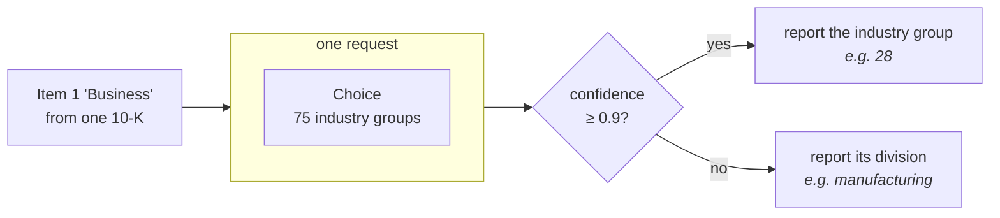

> 每份文件用一道 Choice 把 SEC 年报分到 75 个行业组（industry group）里，再读答案自身的 confidence，来决定是报这个组，还是它上一层更粗的分部（division）。

每一家向 SEC 递交年报的公司都会在年报里描述自己的业务。我们把那些描述按 Standard Industrial Classification 分类：75 个行业组，每份文件一道 `Choice` 问题。

大多数申报文件很好分，地区银行就是地区银行。有些不好分：刚刚卖掉两个业务分部（segment）之一的那家公司，或者描述自己打算进入、而不是正在经营的业务的初创公司。

model 无论如何都得挑一个组，而难题的答案看上去和简单题的答案没有任何区别。区分难题和简单题通常就是成本所在：再加一个 model、额外的调用、人工复核。

`Choice` 自己就会告诉你。除了胜出的选项，它还会返回 `confidence`：当几乎全部概率都落在一个选项上时它很高，当概率散在好几个选项上时它很低。这一个数就把能信的答案和不能信的答案分开了。

对于不能信的答案怎么办，取决于你的标签体系。SIC 标签构成一个层级：行业组向上归并成更粗的分部。这让一次响应几乎不额外花钱：当 model 对行业组没把握时，就报它所属的分部。粗标签可以由细标签推导出来，所以不需要第二次调用。

在 60 份申报文件上，把 confidence 的阈值（threshold）定在 0.9 正好把它们一分为二。有把握的那一半有 90% 的时候是对的；另一半是 40%。往上报一层之后，那 40% 变成 70%。

最后我们得到一个 `classify()` 函数：每份文件一次请求，返回一个标签以及它有多具体。



## 环境准备

```bash
pip install ipython matplotlib "typesafe-sdk>=0.5.7" cooksafe --extra-index-url https://pypi.typesafe.ai/
```

然后设置 `TYPESAFE_API_KEY`。每次 API 调用都会缓存到 `json_cache.json`，这个文件随 cookbook 一起发布，所以重新渲染时会重放已发布的数字，而不去调用 API。删掉那个文件就能全部真跑一遍。

下面的数字来自 2026-08-12 的 `jev-1.12`。

```python
import json
from collections import defaultdict
from pathlib import Path

import matplotlib
import matplotlib.pyplot as plt
from cooksafe import JsonCache, make_playground_link
from IPython.display import Markdown, display
from typesafe_sdk import Choice, TypeSafeClient

matplotlib.use("Agg")  # headless render

import os  # noqa: E402

TYPESAFE_MODEL = "jev-1.12"
CONFIDENT = 0.9  # above this the group is reported; below it, the division

client = TypeSafeClient(
    api_key=os.environ.get(
        "TYPESAFE_API_KEY", "cache-only"
    ),  # keyless kernels replay the cache
    base_url=os.environ.get("TYPESAFE_ENDPOINT"),
    timeout=120.0,
)
json_cache = JsonCache(Path("json_cache.json"))
```

## 搭出分类体系的两层

`sic_codes.tsv` 是 SEC 公布、供申报人自选代码的行业清单，抓取于 2026-08-10：444 个四位代码，每个带一个行业名称。这些数字本身就是一个层级。前两位是**主组（major group）**（这里共 75 个，从 `01` agricultural production 到 `99` non-classifiable），而固定的主组区间构成十个**分部（division）**，这是 SIC 里最粗的一层切分。

这两层都从这同一个文件里算出来，不涉及任何 model：先把代码按前两位分组，再把这些两位数字映射到分部。

```python
DIVISIONS = [
    (1, 9, "agriculture, forestry and fishing"),
    (10, 14, "mining"),
    (15, 17, "construction"),
    (20, 39, "manufacturing"),
    (40, 49, "transportation, communications and utilities"),
    (50, 51, "wholesale trade"),
    (52, 59, "retail trade"),
    (60, 67, "finance, insurance and real estate"),
    (70, 89, "services"),
    (91, 99, "public administration"),
]

INDUSTRIES: dict[str, str] = {}
for line in Path("sic_codes.tsv").read_text().splitlines()[1:]:
    code, _office, title = line.split("\t")
    INDUSTRIES[code] = title.lower()

GROUPS: dict[str, list[str]] = defaultdict(list)
for code in sorted(INDUSTRIES):
    GROUPS[code[:2]].append(code)

def division(group: str) -> str:
    number = int(group)
    return next(name for low, high, name in DIVISIONS if low <= number <= high)

print(
    f"{len(INDUSTRIES)} industries -> {len(GROUPS)} major groups -> {len(DIVISIONS)} divisions"
)
print(
    f"  group 35 = {division('35')} / {', '.join(INDUSTRIES[c] for c in GROUPS['35'][:3])} ..."
)
```

```
444 industries -> 75 major groups -> 10 divisions
  group 35 = manufacturing / engines & turbines, farm machinery & equipment, lawn & garden tractors & home lawn & gardens equip ...
```

一道 Choice 问题需要给每个选项一段描述，而组自己的名字并不总是存在：75 个组里有 42 个在 SEC 的清单里带一个统括名称，其余的没有。于是每个组用它内部的行业来描述，反正读文件的人本来也是拿这些行业去对号入座的。

```python
MAX_NAMED = (
    8  # industries listed per group; enough to characterise it without a wall of text
)

def describe(group: str) -> str:
    umbrella = INDUSTRIES.get(f"{group}00")
    inside = [INDUSTRIES[c] for c in GROUPS[group] if c != f"{group}00"][:MAX_NAMED]
    listed = "; ".join(inside)
    return (
        f"{umbrella} — includes: {listed}"
        if umbrella and listed
        else (umbrella or listed)
    )

print(f"group 20: {describe('20')[:150]}")
print(f"\ngroup 65: {describe('65')[:150]}")
```

```
group 20: food and kindred products — includes: meat packing plants; sausages & other prepared meat products; poultry slaughtering and processing; dairy product

group 65: real estate — includes: real estate operators (no developers) & lessors; operators of nonresidential buildings; operators of apartment buildings; less
```

## 申报文件

`filings.jsonl` 里是 60 份年报（10-K），每份都裁到 Item 1 "Business"，也就是公司描述自己做什么的那一节，这也是行业代码唯一相关的那部分。它们跨越 1993–2024，长度从 700 到 2,200 词。每一份都带着申报人自己选的 SIC 代码，以及用来在 EDGAR 上查到它的 accession number。

在谈任何准确率数字之前，先要看清这个标签是哪来的。它是自报的：准备申报文件的人只挑过一次，而当公司把代码所指的业务卖掉、却留着这个代码时，它就过期了。

这 60 份已经筛选成「自身文本支持它带着的代码」的那些文件，所以这里的数字衡量的是这套做法，而不是 EDGAR 元数据的状态。

```python
FILINGS = [json.loads(line) for line in Path("filings.jsonl").read_text().splitlines()]
example = FILINGS[7]
print(
    f"{len(FILINGS)} filings, {sum(f['words'] for f in FILINGS) // len(FILINGS)} words on average"
)
print(f"\n{example['id']} (filed {example['year']}, accession {example['accession']}):")
print(f"  {example['text'][:230]}...")
print(f"  filer's code: {example['sic']} {INDUSTRIES[example['sic']]}")
```

```
60 filings, 1438 words on average

1389870_2008 (filed 2008, accession 0001079974-09-000155):
  Item 1. DESCRIPTION OF BUSINESS. NARRATIVE DESCRIPTION OF THE BUSINESS Across America Financial Services, Inc. is a corporation which was formed under the laws of the State of Colorado on December 1, 2005. Until March 23, 2007, we...
  filer's code: 6163 loan brokers
```

## 问一道 Choice 问题，读它的 confidence

一道 `Choice` 问题，选项就是那 75 个组。整个分类体系塞得进一次请求：Choice 在大概 240 个选项以内都稳定可用，75 远在这个范围内。

答案回来时带着 `choice`，即胜出的组；`probabilities`，即 75 个组各自的权重；以及 `confidence`，它说明这份分布有多集中。

这套做法读的是 `confidence`，而不是胜者自己的概率。胜者 0.45、第二名 0.44，和胜者 0.45、其余权重稀稀拉拉散着，是两种不同的情况，而 `confidence` 正是把它们区分开的东西。

```python
QUESTION = (
    "Which broad industry does this company operate in? Judge the company's own operations "
    "as this filing describes them."
)

def questions() -> dict:
    return {
        "group": Choice(
            instructions=QUESTION,
            criteria={group: describe(group) for group in sorted(GROUPS)},
        )
    }

@json_cache
def ask(filing_id: str, text: str) -> dict:
    response = client.system_one(
        state=text, questions=questions(), model=TYPESAFE_MODEL
    )
    answer = response.answers["group"]
    return {
        "group": answer.choice,
        "confidence": answer.confidence,
        "probabilities": dict(answer.probabilities),
    }
```

## 有把握就报行业组，没把握就报分部

下面这四行就是整套做法。confidence 在 0.9 及以上时，答案按行业组上报；低于这个值时，同一个答案按它所在的行业组所属的分部上报。

每一份文件仍然会拿回一个可用的标签。model 没能很有把握地分类的那些，会往上一层回来，而不是被丢掉或转给别人。如果某个分部对你的应用来说太粗、没法据此行动，这个分支就是把它交给人的地方。

```python
def classify(filing: dict) -> dict:
    answer = ask(filing["id"], filing["text"])
    sure = answer["confidence"] >= CONFIDENT
    return {
        "level": "group" if sure else "division",
        "label": answer["group"] if sure else division(answer["group"]),
        "confidence": answer["confidence"],
        "group": answer["group"],
    }

def show(filing: dict) -> None:
    result = classify(filing)
    named = describe(result["group"]).split(" — ")[0][:46]
    print(
        f"  {filing['id']:>13}  conf {result['confidence']:.2f}  -> {result['level']:<8} "
        f"{result['label']:<14} (group {result['group']}: {named})"
    )

print("three filings the model was sure about:")
for f in sorted(FILINGS, key=lambda f: -ask(f["id"], f["text"])["confidence"])[:3]:
    show(f)
print("\nthree it was not:")
for f in sorted(FILINGS, key=lambda f: ask(f["id"], f["text"])["confidence"])[:3]:
    show(f)
```

```
three filings the model was sure about:
    310158_1996  conf 1.00  -> group    28             (group 28: chemicals & allied products)
     33416_1998  conf 1.00  -> group    63             (group 63: life insurance; accident & health insurance; h)
    352541_1996  conf 1.00  -> group    49             (group 49: electric, gas & sanitary services)

three it was not:
   1372167_2013  conf 0.22  -> division manufacturing  (group 38: search, detection, navagation, guidance, aeron)
   1398633_2009  conf 0.23  -> division wholesale trade (group 50: wholesale-durable goods)
     46653_1999  conf 0.29  -> division services       (group 87: services-engineering, accounting, research, ma)
```

confidence 的高低和每份文件的分类难度对得上。1.00 的那三份分别是一家制药公司、一家人寿保险公司和一家公用事业公司；三者纸面上都是控股公司，但每一家都有一个申报文件里直接点名的、占主导的业务。

最下面那三份更难，难在哪里你从文本里读得出来。两份是描述自己打算开办的业务的开发阶段公司（Nevaeh "intends to operate as a software developer"，Barricode 是 "organized to enter into the computer security software industry"），第三份有两个业务分部，并在递交前几周卖掉了其中一个。这三份都是以分部、而不是以行业组回来的。

`classify()` 就是整套做法。把 `ask()` 指向你自己的文档，再为你的分类体系重写 `describe()`，其余部分都能照搬。

## 更粗的答案换来了什么

全部 60 份文件，对照每个申报人自己选的代码打分，两种策略各跑一遍：每次都报一个行业组，或者只要 confidence 低于 0.9 就报分部。

```python
def correct(filing: dict, result: dict) -> bool:
    gold_group = filing["sic"][:2]
    if result["level"] == "group":
        return result["label"] == gold_group
    return result["label"] == division(gold_group)

results = [(f, classify(f)) for f in FILINGS]
sure = [(f, r) for f, r in results if r["level"] == "group"]
unsure = [(f, r) for f, r in results if r["level"] == "division"]

forced = sum(r["group"] == f["sic"][:2] for f, r in results)
broadened = sum(correct(f, r) for f, r in results)

print(f"forced to name a group every time      {forced}/{len(results)} right")
print(
    f"  of those, the {len(sure)} it was sure about  "
    f"{sum(r['group'] == f['sic'][:2] for f, r in sure)}/{len(sure)} right"
)
print(
    f"  and the {len(unsure)} it was not           "
    f"{sum(r['group'] == f['sic'][:2] for f, r in unsure)}/{len(unsure)} right"
)
print(
    f"\nletting it answer coarsely when unsure  {broadened}/{len(results)} useful answers"
)
```

```
forced to name a group every time      39/60 right
  of those, the 30 it was sure about  27/30 right
  and the 30 it was not           12/30 right

letting it answer coarsely when unsure  48/60 useful answers
```

model 有把握的地方，它报出的组十次里有九次是对的。没把握的地方，报行业组错得比对的还多，只有 40%。把同样这些答案按分部上报，就能到 70%。

下面这张图把两种策略并排放在一起，并按 model 是否有把握拆开。

```python
labels = ["sure\n(group reported)", "unsure\n(division reported)"]
forced_split = [
    sum(r["group"] == f["sic"][:2] for f, r in sure) / len(sure),
    sum(r["group"] == f["sic"][:2] for f, r in unsure) / len(unsure),
]
broad_split = [
    sum(correct(f, r) for f, r in sure) / len(sure),
    sum(correct(f, r) for f, r in unsure) / len(unsure),
]

fig, ax = plt.subplots(figsize=(7, 3.6))
x = range(len(labels))
ax.bar(
    [i - 0.19 for i in x],
    forced_split,
    0.38,
    label="always name a group",
    color="#c8ccd4",
)
ax.bar(
    [i + 0.19 for i in x],
    broad_split,
    0.38,
    label="answer broadly when unsure",
    color="#3b6ea5",
)
for i, (a, b) in enumerate(zip(forced_split, broad_split)):
    ax.text(i - 0.19, a + 0.02, f"{a:.0%}", ha="center", fontsize=9)
    ax.text(i + 0.19, b + 0.02, f"{b:.0%}", ha="center", fontsize=9)
ax.set_xticks(list(x))
ax.set_xticklabels(
    [f"{lab}\nn={n}" for lab, n in zip(labels, [len(sure), len(unsure)])]
)
ax.set_ylabel("labels that are right")
ax.set_ylim(0, 1.12)
ax.set_title("Where the broader answer helps: the filings it was unsure about")
ax.legend(frameon=False, loc="upper right")
ax.spines[["top", "right"]].set_visible(False)
plt.tight_layout()
display(fig)
```

> （原文此处有一张示意图：两种策略的对比柱状图。横轴按「有把握（报行业组）」与「没把握（报分部）」分成两组，每组两根柱子，分别是「总是报行业组」（灰色）与「没把握时给粗答案」（蓝色）；纵轴是标签正确的比例，每根柱顶标有百分比，横轴标签下还带各自的分母 n，右上角有图例。）

## 在 playground 里打开

这个分享链接里装了一份申报文件和那道 75 个选项的问题，不用写任何代码就能看到它产生的分布和 confidence。

```python
playground_link = make_playground_link(
    example["text"], questions(), models=[TYPESAFE_MODEL]
)
display(
    Markdown(
        f"🔗 [Open the filing + question in the TypeSafe playground]({playground_link})"
    )
)
```

> （原文此处还有一个 Playground 分享链接，标题为「Open the filing + question in the TypeSafe playground →」，因离线环境不可点，已略去。）
