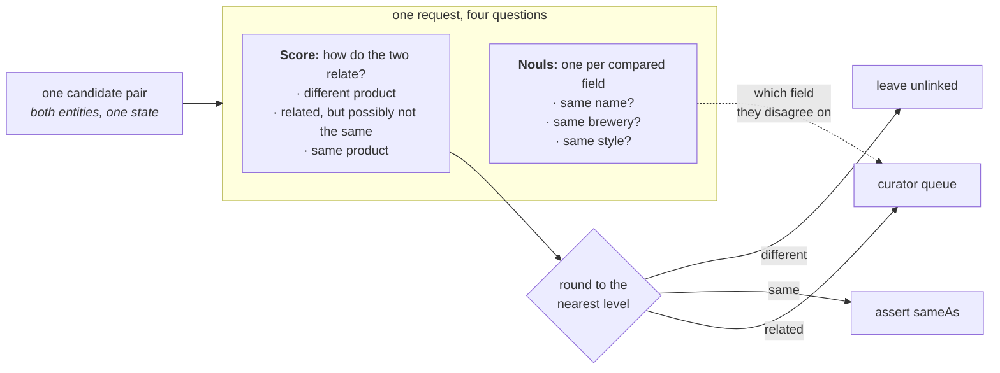

> 判断来自两个啤酒目录的 450 对候选里，哪些描述的是同一个产品。整个决定由一道 TypeSafe Score 问题承载，因为它的三个 level 正好就是对一对候选能做的三件事：合并、保持不连边、或者交给人工策展者。没有需要拟合的 threshold，同一请求里还搭着三道 `Noul` 问题，告诉策展者两个来源在哪个字段上不一致。

知识图谱（knowledge graph）里的一个关键问题是判断一条进来的实体是否与已有实体重复，尤其在只有来自不同来源的自然语言可用时。给定一批可能有重复的候选对，一道 TypeSafe `Score` 就能决定每一对是否是重复，或者是否需要策展者细看。

假设两个数据源描述了有重叠的同一批东西，而你需要知道一边的哪条记录和另一边的哪条记录是同一个东西。知识图谱把那些记录叫做**实体**（entity），并持有关于每个实体记录下来的事实。某个便宜但粗糙的第一遍已经比较过两个来源，挑出了 450 对值得细看的候选。剩下的就是为每一对做出判断。

不合当地合并两个实体是代价更高的错误，因为关于其中任一实体的每个事实现在都描述着合并后的那一个，而任何链接到其中之一的也都一并跟过来。以后想撤销，就得先弄清哪个事实来自哪里。漏掉一个匹配只会留下一条重复，所以这个判断需要第三个选项：既不适合安全合并、也不适合安全丢弃的那些对。

这个判断是一道 `Score` 问题，三个结果各占一个 level：

- undefined*different product**——让两个实体保持不连边
- undefined*related, but possibly not the same**——交给策展者决定
- undefined*same product**——合并它们

我们选 `Score` 问题，是因为想把一个语义标签（也就是评分 criteria）直接挂到每个结果上，包括中间那个结果。`Noul` 问题也能做到，但它只能改为对输出做阈值化来间接达成；而 `Choice` 问题会丢掉三个结果之间的有序关系。

接着，对实体里每个我们想考虑的字段，可以问一批「这些字段是否一致」的 `Noul` 问题，它们搭在同一次请求里。如果 score 既没落到 **same product** 也没落到 **different product**，这些 noul 就为策展者提供更细的信息。

最后你会得到一个 `route()`：它拿一对候选，返回三种结果之一，没有任何需要你对着自己的数据去拟合的 threshold。



## 环境准备

```bash
pip install matplotlib ipython "typesafe-sdk>=0.5.7" cooksafe --extra-index-url https://pypi.typesafe.ai/
```

然后设置 `TYPESAFE_API_KEY`。每次调用都缓存到 `json_cache.json`，该文件随本 cookbook 一起提供，所以重新渲染会重放公布的数字，不调用 API。删掉那个文件即可把一切实跑一遍。

下面的数字来自 2026-08-11 的 `jev-1.12`。

```python
import json
import os
from concurrent.futures import ThreadPoolExecutor
from pathlib import Path

import matplotlib
import matplotlib.pyplot as plt
from cooksafe import JsonCache, make_playground_link
from IPython.display import Markdown, display
from typesafe_sdk import Noul, Score, TypeSafeClient

matplotlib.use("Agg")  # headless render

TYPESAFE_MODEL = "jev-1.12"
MAX_WORKERS = 6  # small pool; the public endpoint rate-limits above roughly eight

client = TypeSafeClient(
    api_key=os.environ.get(
        "TYPESAFE_API_KEY", "cache-only"
    ),  # keyless kernels replay the cache
    base_url=os.environ.get("TYPESAFE_ENDPOINT"),
    timeout=120.0,
)
json_cache = JsonCache(Path("json_cache.json"))
```

## 加载候选对

这些配对来自一个已公布的基准集合，即 Magellan 数据集里的 Beer 数据：两个从不同网站抓来的啤酒目录，已经被那第一遍粗糙处理裁到 450 对。每个实体带四个字段：name、brewery、style 和酒精含量。每一对还带 `known_same_as`，即基准自己的答案。

文本保持出版原样，不做预处理：从未转换回字符的 HTML 实体、被拆成独立单词的撇号、少数被错误解码的字符。

每一对发一次请求，所以你的花费取决于被交到你手上的配对数量，而不是任一来源的规模。

```python
PAIRS = json.loads(Path("candidate_pairs.json").read_text(encoding="utf-8"))
BY_ID = {pair["id"]: pair for pair in PAIRS}

print(f"{len(PAIRS)} candidate pairs. The first one, as the model will see it:")
print(json.dumps({k: PAIRS[0][k] for k in ("entity_a", "entity_b")}, indent=2)[:420])
```

```text
450 candidate pairs. The first one, as the model will see it:
{
  "entity_a": {
    "name": "C N Red Imperial Red Ale",
    "brewery": "Redwood Lodge",
    "style": "American Amber / Red Ale",
    "abv": "8.10 %"
  },
  "entity_b": {
    "name": "Kinetic Infrared Imperial Red Ale",
    "brewery": "Kinetic Brewing Company",
    "style": "American Strong Ale",
    "abv": "9.30 %"
  }
}
```

## 对每个候选对问一道 Score 和三道 Noul

两个实体都放进同一个 state，作为 `entity_a` 和 `entity_b`，所以问题是关于**这一对**的，而不是关于任何单独一边。四道问题都搭在同一次请求里。

下面三段 level 描述就是整个决定：每个 level 就是一个结果。本文件里没有任何阈值常量。你也可以在还没见过任何一个 score 之前就把这些描述写好，而一个需要拟合的数字做不到这点。

中间那一级最值得仔细写。这里它覆盖变体、特别版，以及可能指向两款产品中任何一个的名字，所以这些会到达策展者手里，而不是被合并或被丢掉。

`OUTCOME` 给三个结果命名。合并那个结果叫 `assert sameAs`，因为 `sameAs` 是记录两个实体是同一个东西的标准方式，而把它写出来就是合并实际发生的方式。

四个字段里有三个拿到 `Noul` 问题：name、brewery 和 style。酒精含量没有，因为比较两个数字是算术；需要的话在代码里算。要把它用到别的数据上，你只要重写 `QUESTIONS` 和 `LEVELS`。其它知道啤酒的代码只有那两个打印结果的函数，它们会点名这些字段。

```python
LEVELS = [
    "They describe two different products.",
    "They describe closely related products that may or may not be the same one: "
    "a variant, a special edition, or a name that could plausibly refer to either.",
    "They describe one and the same product.",
]
OUTCOME = {0: "leave unlinked", 1: "curator queue", 2: "assert sameAs"}

QUESTIONS = {
    "link_state": Score(
        instructions="How do the two entity descriptions relate as products?",
        criteria=LEVELS,
    ),
    "same_name": Noul(
        instructions="Do the two entities state the same beer name?",
    ),
    "same_brewery": Noul(
        instructions="Are the two entities from the same brewery?",
    ),
    "same_style": Noul(
        instructions="Do the two entities describe the same beer style?",
    ),
}

@json_cache
def score(pair_id: str) -> dict:
    """One request about one candidate pair -> the score plus the three noul answers."""
    pair = BY_ID[pair_id]
    response = client.system_one(
        state={"entity_a": pair["entity_a"], "entity_b": pair["entity_b"]},
        questions=QUESTIONS,
        model=TYPESAFE_MODEL,
    )
    link = response.answers["link_state"]
    return {
        "score": link.score,
        "probabilities": link.probabilities,
        "confidence": link.confidence,
        "properties": {
            k: response.answers[k].noul for k in QUESTIONS if k != "link_state"
        },
        # tokens and requests are the durable units; don't cache a derived cost
        "input_tokens": response.usage.input_tokens or 0,
        "output_tokens": response.usage.output_tokens or 0,
    }

def route(score_value: float) -> str:
    """The whole decision rule: the nearest level names the outcome."""
    return OUTCOME[min(int(score_value + 0.5), len(LEVELS) - 1)]

def show(pair_id: str) -> None:
    pair, result = BY_ID[pair_id], score(pair_id)
    print(
        f"{pair_id}  score {result['score']:.2f}  confidence {result['confidence']:.2f}"
        f"  ->  {route(result['score'])}"
    )
    for side in ("entity_a", "entity_b"):
        e = pair[side]
        print(f"    {e['name'][:44]:<46}{e['brewery'][:30]:<32}{e['style'][:22]}")
    nouls = result["properties"]
    print(
        f"    name {nouls['same_name']:.2f}   brewery {nouls['same_brewery']:.2f}   "
        f"style {nouls['same_style']:.2f}"
    )
```

四对。`c446` 是一个产品，`c427` 是两个。另外两对因不同原因落到中间那一级：`c100` 的 name 与 brewery 相同，但两个来源对它的 style 用词不同；`c428` 则把一款啤酒和它的水果加啤酒花变体配在一起。

```python
for pair_id in ("c446", "c427", "c100", "c428"):
    show(pair_id)
    print()
```

```text
c446  score 1.94  confidence 0.92  ->  assert sameAs
    Thomas Hooker Old Marley Barleywine           Thomas Hooker Brewing Company   American Barleywine
    Thomas Hooker Old Marley Barleywine           Thomas Hooker Brewing Company   Barley Wine
    name 0.97   brewery 0.99   style 0.81

c427  score 0.03  confidence 0.95  ->  leave unlinked
    Frost Quake Bourbon Barrel Aged Barley Wine   Wellington County Brewery       American Barleywine
    Lompoc Bourbon Barrel Aged Proletariat Red A  Lompoc Brewing                  Amber Ale
    name 0.02   brewery 0.09   style 0.08

c100  score 1.30  confidence 0.27  ->  curator queue
    Belle Gueule Rousse                           Brasseurs R.J.                  American Amber / Red A
    Belle Gueule Rousse                           Brasseurs RJ                    Amber Lager/Vienna
    name 0.95   brewery 0.94   style 0.35

c428  score 1.10  confidence 0.77  ->  curator queue
    Ambleside Amber Ale                           Bridge Brewing Company          American Amber / Red A
    Bridge Ambleside Amber Ale - Pomegranate & G  Bridge Brewing Company          Amber Ale
    name 0.63   brewery 0.98   style 0.74
```

## 给每个候选对做路由

```python
# 450 candidate pairs, one request each; a small pool keeps a live run to a few minutes.
with ThreadPoolExecutor(max_workers=MAX_WORKERS) as pool:
    scored = list(pool.map(lambda pair: score(pair["id"]), PAIRS))

scores = [result["score"] for result in scored]
by_outcome: dict[str, list[str]] = {name: [] for name in OUTCOME.values()}
for pair, s in zip(PAIRS, scores):
    by_outcome[route(s)].append(pair["id"])

SURFACE, INK, INK2, MUTED = "#fcfcfb", "#0b0b0b", "#52514e", "#898781"
GRID, AXIS, BLUE, ORANGE = "#e1e0d9", "#c3c2b7", "#2a78d6", "#eb6834"

BINS, TOP = 20, len(LEVELS) - 1
counts = [0] * BINS
for s in scores:
    counts[min(int(s / TOP * BINS), BINS - 1)] += 1
centers = [(i + 0.5) / BINS * TOP for i in range(BINS)]
queued = [c if route(x) == "curator queue" else 0 for c, x in zip(counts, centers)]
settled = [c if route(x) != "curator queue" else 0 for c, x in zip(counts, centers)]

fig, ax = plt.subplots(figsize=(7.2, 3.6), facecolor=SURFACE)
ax.set_facecolor(SURFACE)
for side in ("top", "right"):
    ax.spines[side].set_visible(False)
for side in ("left", "bottom"):
    ax.spines[side].set_color(AXIS)
ax.tick_params(colors=MUTED, labelcolor=INK2, labelsize=9)
ax.set_axisbelow(True)
ax.grid(axis="y", color=GRID, linewidth=0.8)
ax.bar(
    centers, settled, width=TOP / BINS * 0.9, color=BLUE, label="settled automatically"
)
ax.bar(
    centers, queued, width=TOP / BINS * 0.9, color=ORANGE, label="sent to the curator"
)
for edge in (0.5, 1.5):
    ax.axvline(edge, color=INK2, linewidth=1, linestyle="--")
ax.set_xticks([0, 0.5, 1, 1.5, 2])
ax.set_xticklabels(["0\ndifferent", "0.5", "1\nrelated", "1.5", "2\nsame"])
ax.set_xlabel("score for the pair", color=INK2, fontsize=9)
ax.set_ylabel("candidate pairs", color=INK2, fontsize=9)
ax.set_title(
    f"{len(PAIRS)} candidate pairs, scored once each",
    loc="left",
    color=INK,
    fontsize=11,
)
ax.legend(frameon=False, labelcolor=INK2, fontsize=9)
display(fig)
plt.close(fig)

for name in ("assert sameAs", "curator queue", "leave unlinked"):
    n = len(by_outcome[name])
    print(f"{name:<16}{n:>5}  ({n / len(PAIRS):>5.1%})")
```

```text
assert sameAs      40  ( 8.9%)
curator queue      50  (11.1%)
leave unlinked    360  (80.0%)
```

`route()` 改变答案的那两个 score 值就是切点。大多数配对都尘埃落定：360 个低于下切点，40 个高于上切点，剩下 50 个留给策展者。

在这批数据上，score 并不整齐地落在整数上。大多数落在 0.25 附近。两款毫无共同点的啤酒可能仍共享一个 style 名，而它们的 brewery 名可能看着相像，所以模型把中间那一级分到一些概率，而不是零。决定一对的是它落在某个切点的哪一侧，而不是它离某个 level 有多近。

两个切点的拥挤程度并不相同。有九对落在上切点（1.5）的 0.1 以内，而这个切点决定的是什么会被合并进图谱。有四十七对离下切点（0.5）这么近，而这个切点只决定策展者是否看到这一对。这两个数字都不是你能调的东西。两者都源自你如何措辞那些 level，而中间那一级的措辞才是把配对在策展者与保持不连边之间挪动的关键。

## 在 playground 里打开

下面的 playground 链接打开 `c428`，它得分 1.10，去了策展者。它把「Ambleside Amber Ale」与「Bridge Ambleside Amber Ale - Pomegranate & Galena Hops」配在一起：同一个 brewery、同样的酒精含量。四道问题都随它一起。

```python
playground_link = make_playground_link(
    {"entity_a": BY_ID["c428"]["entity_a"], "entity_b": BY_ID["c428"]["entity_b"]},
    QUESTIONS,
    models=[TYPESAFE_MODEL],
)
display(
    Markdown(
        f"🔗 [Open this pair + questions in the TypeSafe playground]({playground_link})"
    )
)
```

> **提示：** 原文此处渲染了一个指向 TypeSafe Playground 的分享链接，文字为「Open this pair + questions in the TypeSafe playground」。
