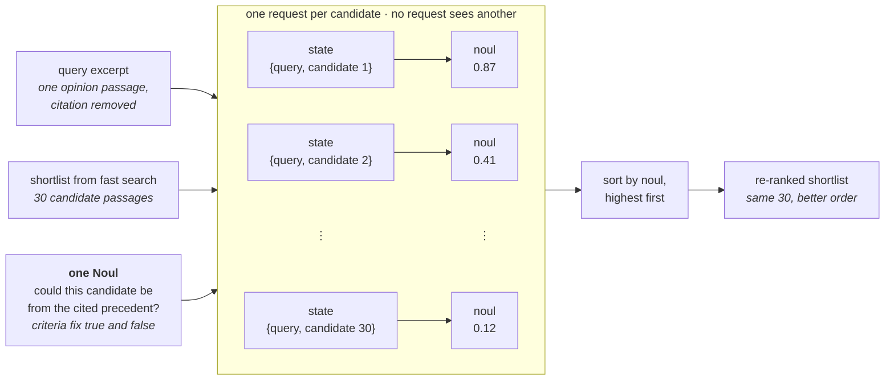

> 本 cookbook 为 40 个 CLERC 法律查询各构建 30 条段落的 BM25 短列表，然后用每个查询—候选对一次 TypeSafe 问题，把 top-1 准确率从 5% 提升到 18%、top-10 准确率从 38% 提升到 62%。

你有成千上万份文档，需要找出能回答某个具体问题的那一份。那么该怎么找？

首先，用关键词匹配这类快速方法，把那成千上万个候选收窄成一个看起来靠谱的短列表。我们称之为快速搜索（fast search）。

快速搜索擅长于此，但它无法告诉你短列表上哪个候选是正确的。这正是重排序（re-ranking）的用武之地。它直接针对查询给短列表上的每个候选打分，并把最好的那个排到第一位。

下面两步都跑在 CLERC 数据集的 3,565 个法庭判决段落上：BM25 为 40 个查询各构建一个 30 个候选的快速搜索短列表，然后 TypeSafe 对每个短列表重排序。有了重排序，正确段落对 18% 的查询排在第一位，而仅靠快速搜索时只有 5%。

**在这个过程中，你将学到：**

- 快速搜索做什么，以及为什么它不是完整的答案
- 重排序是什么，以及它如何衔接在快速搜索步骤之后
- TypeSafe 如何针对一个查询给单个候选打分，以及这能多大程度改善结果

## 亲自试一试

## 如何在成千上万文档中找到目标？

你有一堆文档，还有一个查询（query）——一段描述你在找什么的文字。堆里某处藏着能回答它的那一份文档。

逐个文档对照查询来检查是可行的，每个文档一次比较：百万级文档意味着每个查询百万次比较。你可以用两步法提升性能：

1. 用一种快到能在整堆上运行的方法，把文档堆收窄成一份可能候选的短列表。
2. 对那份短列表施加一个更精确的步骤，找出确切的正确答案。

> （原文此处有一张示意图：文档堆收窄为快速搜索短列表，再由重排序将其重排，使正确答案升到顶部）

本 cookbook 在下方"真实示例中的重排序"小节，用一个法庭判决（court opinion）数据集检验这套方案。

## 什么是快速搜索？

快速搜索是任何能把一个查询对整个大型语料里的每份文档做比较、并快速返回一个排好序的短列表的方法。常见方法包括关键词搜索（如 BM25）和稠密向量嵌入（dense embeddings，按语义比较段落）。系统常常把两种方法结合使用。

这里的第一步只用 BM25，别无其他。BM25 按共享词对段落排序。把这个步骤保持简单，注意力就能留在重排序上——那才是本 cookbook 的重点。快速搜索方法的选择是个旁支问题：重排序只会看到那些进了短列表的段落。

## 什么是重排序？

重排序拿快速搜索已经产出的短列表，把它排成更好的顺序。它不是一次性把查询对整个语料比较，而是把查询分别对照短列表上的每个候选，再按该分数对短列表排序。

> （原文此处有一张示意图：左侧一个排好序的短列表，一个标着"re-rank"的箭头，右侧重排后的版本里正确答案从中间移到了顶部）

分数可以来自语言模型。把查询和单个候选一起交给它，问这个候选能在多大程度上回答该查询。重排序于是在短列表上找到最佳匹配，即使它的措辞与查询不同。

### TypeSafe 返回什么

用 TypeSafe 时，打分请求可以保持为一个是/否问题：

```text
Could this candidate passage be from the cited precedent?
```

一个单纯的"是"或"否"不足以给 30 个候选排序。而一个 `Noul` 会返回一个 0 到 1 之间的数字，称为 [noul](https://docs.typesafe.ai/primitives/noul)。noul 是 TypeSafe 对"答案是是"的可能性的估计。

问题的 criteria 定义了什么算真、什么算假。TypeSafe 把它们套用到每个查询—候选对上，并直接返回 noul。那个 noul 就是应用程序用来排序的分数。无需为通用模型发明一套打分标尺，而且 TypeSafe 天生就能更快、更便宜、更一致地完成这种重复打分。

用简化的伪代码表示，一次 TypeSafe 打分调用长这样：

```python
question = Noul(
    instructions="Is this candidate the cited case?",
    criteria=NoulCriteria(
        true="The candidate states the specific rule the query cites.",
        false="The candidate is only on a similar topic.",
    ),
)
response = client.system_one(state={...}, questions={"is_cited_source": question})
response.answers["is_cited_source"].noul  # -> 0.87
```

TypeSafe 把查询和单个候选一起对照那个问题读取，并返回一个 noul。

你可以用它来重排一个短列表：对短列表上的每个候选运行同一个问题，然后按每次调用返回的 noul 对短列表排序，noul 高的排前面。

```python
nouls = {candidate: ask_typesafe(query, candidate) for candidate in shortlist}
reranked = sorted(shortlist, key=lambda c: nouls[c], reverse=True)  # highest noul first
```

下图展示每个候选一次请求如何产生用于重排短列表的分数。



## 一个重排序示例

快速搜索和重排序现在跑在 [CLERC](https://aclanthology.org/2025.findings-naacl.441/) 这个法律检索数据集上。本示例用 3,565 个法庭判决段落和 40 个查询。

### 环境准备

第一步安装本演练所依赖的包。

- `bm25s` 和 `datasets` 构建快速搜索短列表。
- `typesafe-sdk` 和 `cooksafe` 处理重排序与 API 缓存。
- `matplotlib` 绘制结果图表。

```bash
pip install bm25s datasets matplotlib "typesafe-sdk>=0.5.7" cooksafe --extra-index-url https://pypi.typesafe.ai/
```

下一段代码设置 TypeSafe 客户端和演练其余部分要用到的常量，比如调用哪个 TypeSafe 模型、以及快速搜索交给重排器的短列表有多大。调用 TypeSafe 需要一个 `TYPESAFE_API_KEY`。

```python
import hashlib
import json
import os
import random
from concurrent.futures import ThreadPoolExecutor
from pathlib import Path

import msgspec
from cooksafe import JsonCache
from IPython.display import display
from typesafe_sdk import Noul, NoulCriteria, TypeSafeClient

TYPESAFE_MODEL = "jev-1.12"
PRICE = (
    0.042,
    0.00,
)  # $ per 1M tokens (input, output); TypeSafe jev-1.12 as of 2026-08
N_ROWS = 170  # CLERC rows pooled into the shared corpus
N_QUERIES = 40  # rows we evaluate
TOP_K = 30  # candidates the shortlist hands to the re-ranker, per query

client = TypeSafeClient(
    api_key=os.environ.get(
        "TYPESAFE_API_KEY", "cache-only"
    ),  # keyless kernels replay the cache
    base_url=os.environ.get("TYPESAFE_ENDPOINT"),
    timeout=120.0,
)
json_cache = JsonCache(Path("json_cache.json"))
```

### 用快速搜索对段落排序

这里用的数据集是一个美国法庭判决语料，把 170 行合并成一个语料池。每一行的拆解如下：

- undefined*Query**：一段去掉了引用的判决摘录。
- undefined*Gold**：被去掉的引用所指向的段落，即该查询唯一的正确答案。
- undefined*Candidates**：语料里所有其他段落，每个都可能在误匹配中成为查询的匹配项。

在这 170 行里，挑出 40 行作为查询做评估。其余 130 行只作为候选出现。

下一个 cell 用上述技术构建短列表：1. 加载语料库。2. 用 BM25 对每个查询排序。这里还没有用到 TypeSafe，只是快速搜索这一步。

```python
CLERC_FILE = (
    "https://huggingface.co/datasets/jhu-clsp/CLERC/resolve/main/"
    "teva_train_dir/train_data.jsonl.gz"
)

def cid(text: str) -> str:
    """Corpus id: a content hash, so passages shared across queries dedupe."""
    return hashlib.sha1(text.encode("utf-8")).hexdigest()[:16]

@json_cache
def build_slice(n_rows: int, n_queries: int, seed: int) -> dict:
    """Stream CLERC rows, pool ``n_rows`` of them into a corpus, pick ``n_queries`` to evaluate."""
    from datasets import load_dataset  # heavy import, keep local

    stream = load_dataset("json", data_files=CLERC_FILE, streaming=True, split="train")
    rows = []
    for row in stream:
        if (
            row.get("positive_passages")
            and len(row.get("negative_passages") or []) == 20
        ):
            rows.append(row)
        if len(rows) >= 1000:
            break

    rng = random.Random(seed)
    picked = rng.sample(rows, n_rows)
    corpus, pool = {}, []
    for row in picked:
        gold = row["positive_passages"][0]["text"]
        corpus[cid(gold)] = gold
        for neg in row["negative_passages"]:
            corpus[cid(neg["text"])] = neg["text"]
        pool.append(
            {"qid": str(row["query_id"]), "query": row["query"], "gold": cid(gold)}
        )
    # hold out the first 20 pooled rows; evaluate on the rest
    queries = rng.sample(pool[20:], n_queries)
    # sort the corpus by id so every run — live or cache replay — iterates it identically
    return {"queries": queries, "corpus": dict(sorted(corpus.items()))}

def bm25_rankings(corpus: dict[str, str], queries: dict[str, str], k: int = 100):
    """Rank every passage in the corpus by word overlap with each query."""
    import bm25s

    cids = list(corpus)
    retriever = bm25s.BM25()
    retriever.index(bm25s.tokenize([corpus[c] for c in cids], stopwords="en"))
    qids = list(queries)
    idxs, _ = retriever.retrieve(
        bm25s.tokenize([queries[q] for q in qids], stopwords="en"), k=min(k, len(cids))
    )
    return {q: [cids[i] for i in idxs[row]] for row, q in enumerate(qids)}

def gold_rank(ranked: list[str], gold: str) -> int | None:
    """1-based rank of the gold id, or None if it isn't in the list."""
    return ranked.index(gold) + 1 if gold in ranked else None

SURFACE, INK, INK2, MUTED = "#f8f8f2", "#34342f", "#34342f", "#7c7c77"
GRID, AXIS, BLUE, GREEN = "#d8d8cf", "#d8d8cf", "#5d76a2", "#6f9b52"

def bar_chart(labels: list[str], shares: list[float], title: str) -> None:
    """A small single-series bar chart of shares (0-1, shown as percentages)."""
    import matplotlib.pyplot as plt

    fig, ax = plt.subplots(figsize=(5, 3.2), facecolor=SURFACE)
    ax.set_facecolor(SURFACE)
    for side in ("top", "right"):
        ax.spines[side].set_visible(False)
    for side in ("left", "bottom"):
        ax.spines[side].set_color(AXIS)
    ax.tick_params(colors=MUTED, labelcolor=INK2, labelsize=9)
    ax.set_axisbelow(True)
    ax.grid(axis="y", color=GRID, linewidth=0.8)

    bars = ax.bar(labels, shares, width=0.55, color=[BLUE, GREEN][: len(labels)])
    ax.bar_label(
        bars,
        labels=[f"{s * 100:.0f}%" for s in shares],
        padding=4,
        color=INK,
        fontsize=11,
    )
    ax.set_ylim(0, 1.1)
    ax.set_yticks([0, 0.25, 0.5, 0.75, 1.0])
    ax.set_yticklabels(["0%", "25%", "50%", "75%", "100%"])
    ax.set_ylabel(f"share of {len(queries)} queries", color=INK2, fontsize=9)
    ax.set_title(title, loc="left", color=INK, fontsize=11)
    plt.tight_layout()
    display(fig)
    plt.close(fig)

ds = build_slice(N_ROWS, N_QUERIES, seed=0)
corpus: dict[str, str] = ds["corpus"]
queries = {q["qid"]: q["query"] for q in ds["queries"]}
golds = {q["qid"]: q["gold"] for q in ds["queries"]}

candidates = {q: ranked[:TOP_K] for q, ranked in bm25_rankings(corpus, queries).items()}

in_top_k = sum(golds[q] in candidates[q] for q in queries)
at_rank_1 = sum(candidates[q][0] == golds[q] for q in queries)

bar_chart(
    [f"In top {TOP_K}", "At rank 1"],
    [in_top_k / len(queries), at_rank_1 / len(queries)],
    f"Where the correct passage lands, {len(queries)} queries against {len(corpus):,} candidates",
)
```

### 快速搜索很少把正确段落排到第一

该图展示了在 3,565 个候选中，快速搜索把正确段落放在了什么位置。

快速搜索可靠地把语料收窄成一个包含正确答案的短列表。对 40 个查询中的 100% 它都包含了正确答案。但这个段落很少是短列表上排第一的那个，只有 5% 的时候是。

下面的重排序只重排短列表上已有的前 30 个候选。它无法加入快速搜索没有选中的段落。这里，短列表对全部 40 个查询都包含正确段落，所以重排序可以专注于把每个正确段落放到更好的位置。

### 用 TypeSafe 重排序

重排序针对其查询给短列表上的每个候选打分，然后按该分数排序。TypeSafe 关于每一对所问的问题是：该候选是否就是查询中被去掉的引用所指向的那段。

下一个 cell 做以下事情：1. 定义那个问题。2. 对每个短列表上的每个候选问一次，40 个查询乘以 30 个候选，共 1,200 次调用，并发执行而非依次执行。3. 按 TypeSafe 返回的分数对每个短列表排序，得到重排结果。

```python
is_cited_source = Noul(
    instructions=(
        "The query excerpt comes from a US federal court opinion and was written "
        "immediately around a citation to a precedent; the citation itself has been "
        "removed. Could the candidate passage be from that cited precedent — does it "
        "establish the specific legal proposition the query excerpt invokes at its "
        "citation point?"
    ),
    criteria=NoulCriteria(
        true=(
            "The candidate passage states or establishes the specific rule, standard, "
            "holding, or fact pattern that the query excerpt attributes to its removed "
            "citation."
        ),
        false=(
            "The candidate passage is merely on a similar topic or doctrine; it does not "
            "supply the specific proposition the query excerpt relies on."
        ),
    ),
)

@json_cache
def score_candidate(model: str, query: str, candidate: str, question_json: str) -> dict:
    """One TypeSafe call about one (query, candidate) pair: a noul, plus token usage."""
    # the SDK takes a question as its JSON dict, so the cached string decodes straight in
    question = json.loads(question_json)
    response = client.system_one(
        state={"query_excerpt": query, "candidate_passage": candidate},
        questions={"is_cited_source": question},
        model=model,
    )
    return {
        "noul": response.answers["is_cited_source"].noul,
        "input_tokens": response.usage.input_tokens or 0,
        "output_tokens": response.usage.output_tokens or 0,
    }

# Each of the 40 queries has 30 candidates, so re-ranking every shortlist means 1,200 independent
# calls — cheap enough to fire all at once with a thread pool instead of one after another.
pair_list = [(q, c) for q in queries for c in candidates[q]]
question_json = msgspec.json.encode(is_cited_source).decode()
with ThreadPoolExecutor(max_workers=12) as pool:
    results = pool.map(
        lambda p: score_candidate(
            TYPESAFE_MODEL, queries[p[0]], corpus[p[1]], question_json
        ),
        pair_list,
    )
pair_scores = {q: {} for q in queries}
for (q, c), result in zip(pair_list, results):
    pair_scores[q][c] = result

reranked = {
    q: sorted(candidates[q], key=lambda c: -pair_scores[q][c]["noul"]) for q in queries
}

def chart_before_after(
    runs: dict[str, dict[str, list[str]]], thresholds: list[int]
) -> None:
    """Grouped bar chart: how often the correct passage lands in the top N, for each run."""
    import numpy as np
    import matplotlib.pyplot as plt

    labels = list(runs)
    colors = [BLUE, GREEN]

    def share_in_top(rankings, k):
        return sum(
            gold_rank(rankings[q], golds[q]) in range(1, k + 1) for q in queries
        ) / len(queries)

    fig, ax = plt.subplots(figsize=(6.5, 3.6), facecolor=SURFACE)
    ax.set_facecolor(SURFACE)
    for side in ("top", "right"):
        ax.spines[side].set_visible(False)
    for side in ("left", "bottom"):
        ax.spines[side].set_color(AXIS)
    ax.tick_params(colors=MUTED, labelcolor=INK2, labelsize=9)
    ax.set_axisbelow(True)
    ax.grid(axis="y", color=GRID, linewidth=0.8)

    x = np.arange(len(thresholds))
    width = 0.35
    for i, (label, rankings) in enumerate(runs.items()):
        shares = [share_in_top(rankings, k) for k in thresholds]
        offset = (i - (len(labels) - 1) / 2) * width
        bars = ax.bar(x + offset, shares, width * 0.92, color=colors[i], label=label)
        ax.bar_label(
            bars,
            labels=[f"{s * 100:.0f}%" for s in shares],
            padding=3,
            color=INK2,
            fontsize=8.5,
        )

    ax.set_xticks(x, [f"top {k}" for k in thresholds])
    ax.set_ylim(0, 1)
    ax.set_yticks([0, 0.25, 0.5, 0.75, 1.0])
    ax.set_yticklabels(["0%", "25%", "50%", "75%", "100%"])
    ax.set_ylabel(f"share of {len(queries)} queries", color=INK2, fontsize=9)
    ax.set_title(
        "How often the correct passage lands near the top",
        loc="left",
        color=INK,
        fontsize=11,
    )
    ax.legend(frameon=False, labelcolor=INK2, fontsize=9, loc="upper left")
    plt.tight_layout()
    display(fig)
    plt.close(fig)

chart_before_after(
    {"Fast search": candidates, "+ TypeSafe re-rank": reranked}, [1, 5, 10]
)

calls = [pair_scores[q][c] for q in queries for c in pair_scores[q]]
input_tokens = sum(call["input_tokens"] for call in calls)
output_tokens = sum(call["output_tokens"] for call in calls)
cost = input_tokens / 1_000_000 * PRICE[0] + output_tokens / 1_000_000 * PRICE[1]
print(
    f"{len(calls)} TypeSafe calls used {input_tokens:,} input and "
    f"{output_tokens:,} output tokens, costing ${cost:.4f}."
)
```

```text
1200 TypeSafe calls used 1,536,002 input and 25,200 output tokens, costing $0.0645.
```

### 重排序把正确答案推向顶部

该图在三个阈值下比较快速搜索与"快速搜索 + 重排序"。重排序在每一个阈值下都把正确段落推得更靠近顶部：

- undefined*Top 1** —— 5% → 18%
- undefined*Top 5** —— 15% → 35%
- undefined*Top 10** —— 38% → 62%

所报告的 token 数与成本覆盖了用于重排这 40 个短列表的全部 1,200 次 TypeSafe 调用。

每个 CLERC 行包含一段正确段落和 20 段负例段落。本演练把 170 行的段落汇成一个共享语料。对 40 个评估查询中的每一个，BM25 都从那个完整语料里选出 30 个候选，而不只是该行自带的 20 个负例。然后 TypeSafe 把查询对照每个被选中的候选读取，并重排这 30 个段落。

本演练为了清晰，每对只问一个问题。真实应用会在一个调用里就同一对问若干个问题。做法见 [并行提问 cookbook](https://docs.typesafe.ai/cookbooks/parallel_questions) 和 [投機式扇出（Speculative Fan-Out）模式](https://docs.typesafe.ai/patterns/fan-out)。

## 下一步

同样的构件也出现在 TypeSafe 文档的其它地方：

- [Noul](https://docs.typesafe.ai/primitives/noul)，讲 TypeSafe 如何把一个是/否问题变成分数。
- [投機式扇出（Speculative Fan-Out）](https://docs.typesafe.ai/patterns/fan-out)，讲如何在一个调用里就一份文档问若干个问题。
- [逐行搜索（Line-by-line Search）](https://docs.typesafe.ai/cookbooks/semantic_find)，讲另一种按语义而非关键词搜索语料的方法。
