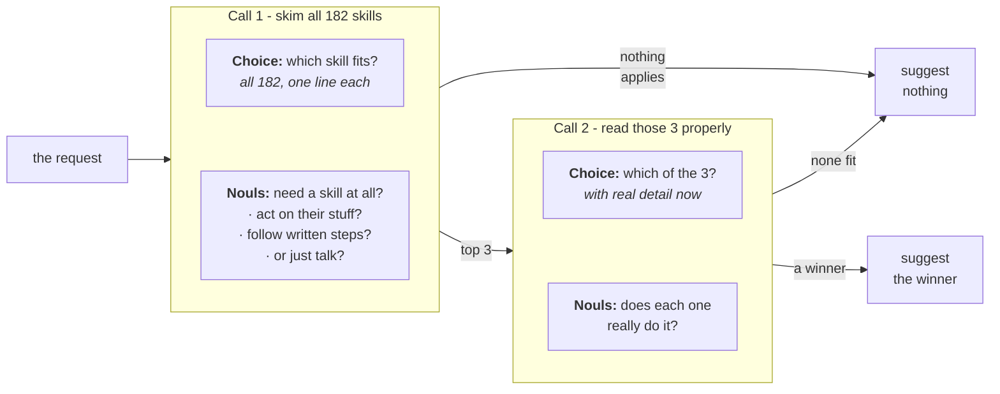

> 从 Nous Research 的 Hermes 目录里那 182 个 skill 中，为一次 agent turn 最多挑出一个：一次 TypeSafe 请求给所有 skill 排序并判断这次 turn 到底需不需要 skill，第二次请求认真读前三个、且可以全部否决。胜者的名字进入 agent system prompt 的一行，而它加载错的 skill、以及本不该加载却加载了的 skill，都下降一半以上。

Agents 选 skill 的方式是把它们全部截断后塞进 system message，这会推高成本、劣化 skill 选择表现，并让会话后续的上下文腐化。我们的对策是每次 turn 用两次 TypeSafe 请求，一次给 skill 排序，一次验证这个选择，把错误的 skill 加载减少一半以上。

拥有庞大 skill roster 的 agent，几乎是在没有信息的情况下做选择。roster 以索引形式到达它手里：每个 skill 一行，描述被截断，免得全文挤掉对话。本文用的 agent 框架 Hermes 默认截到 60 个字符。例如在这个宽度下，「编辑」`.pptx` 文件的 skill 和「创作」它们的 skill 读起来几乎一样。要一份 pitch deck，agent 可能加载错的那个。而在某次 turn 根本没有合适的 skill 时，它仍可能随便加载一个，因为一串名字就是在邀请人猜。

本 cookbook 不动那些描述，而是改用渐进式披露（progressive disclosure）：便宜地读完全部 182 个 skill，再细读其中三个。在「加载哪个 skill（如果需要的话）」这个决定前面放两次 TypeSafe 请求。第一次把 roster 里每个 skill 与用户这次 turn 对齐排序，并回答这次 turn 到底需不需要 skill。第二次只重读前三个，此时带上每个 skill 的完整描述与它 instructions 的开头，并且可以全部否决。

胜者的名字会作为这次 turn 的 system prompt 里额外的一行：

```text
<skill_relevance>
Relevant to the current request: pptx-author. Ignore this if it does not fit what the user
actually asked for.
</skill_relevance>
```

agent 保留它完整的索引和自己的判断，那一行只告诉它先看哪一条。roster 本身从不改变，所以针对它的任何前缀缓存都还有效。以下是针对 `claude-haiku-4-5-20251001` 的 488 次请求，使用的 skill 来自 Hermes roster：

| 条件 | 加载了错误的 skill | 本不该加载却加载了 |
| --- | --- | --- |
| 只有 agent，仅带自己的 roster | 16.8% | 9.8% |
| **带 TypeSafe 建议的 agent** | **7.3%** | **4.0%** |
| 直接拿到正确答案的 agent | 2.5% | 1.2% |

第三行说明犯错的底线不是零，因为即便把正确的 skill 交给 agent，它也不总会加载，而没有任何选择方法能越过这一点，无论它多好。

最后你会得到一个 `suggest()` 函数，最多返回一个 skill 名；一个把它包装起来供 system prompt 使用的 `suggestion_block()`；以及产出上表的 harness，可以指向你自己的 roster。



## 环境准备

- 安装 TypeSafe client、Anthropic client，以及共享的 cookbook 辅助模块。
- 设置一个 [TypeSafe API key](https://console.typesafe.ai/keys)，以及一个给被测量 agent 用的 Anthropic key。

```bash
pip install anthropic matplotlib ipython "typesafe-sdk>=0.5.7" cooksafe --extra-index-url https://pypi.typesafe.ai/
export TYPESAFE_API_KEY=your-key-here
export ANTHROPIC_API_KEY=your-key-here
```

> **注意：** 下面的代码块是同一个脚本，按顺序排列。要跟着做，就把它们按所示顺序放进一个文件。

## 缓存结果

`JsonCache` 保存每次调用的结果，以输入为键，所以重跑会重放下面的数字，而不是调用任一 API。删除 `json_cache.json` 即可实跑。公布的这次运行使用了 `jev-1.12` 和 `claude-haiku-4-5-20251001`，渲染于 2026-07-31。

```python
import json
import os
from collections import defaultdict
from concurrent.futures import ThreadPoolExecutor
from pathlib import Path
from time import perf_counter

import anthropic
import matplotlib
import matplotlib.pyplot as plt
from matplotlib.ticker import PercentFormatter
from cooksafe import JsonCache, make_playground_link
from IPython.display import Markdown, display
from typesafe_sdk import Choice, Noul, TypeSafeClient

matplotlib.use("Agg")  # headless render

TYPESAFE_MODEL = "jev-1.12"
AGENT_MODEL = (
    "claude-haiku-4-5-20251001"  # the agent under test, pinned so scores are stable
)

SHORTLIST = 3  # candidates carried from the first request into the second
EXCERPT_CHARS = (
    700  # SKILL.md characters each candidate brings; the roster file stores 1600
)
GATE_THRESHOLD = (
    0.30  # mean of the three request nouls, below which nothing is suggested
)
FITS_THRESHOLD = (
    0.30  # a shortlist whose best "does this fit" noul is under this is dropped
)
WORKERS = 8  # small pool: enough to keep a live run to minutes, gentle on rate limits

assert EXCERPT_CHARS <= 1600, (
    "the shipped roster file stores 1600 body characters per skill"
)

client = TypeSafeClient(
    api_key=os.environ.get(
        "TYPESAFE_API_KEY", "cache-only"
    ),  # keyless kernels replay the cache
    base_url=os.environ.get("TYPESAFE_ENDPOINT"),
    timeout=120.0,
)
agent = anthropic.Anthropic(api_key=os.environ.get("ANTHROPIC_API_KEY", "cache-only"))
json_cache = JsonCache(Path("json_cache.json"))
```

## 第 1 步：加载 roster

`hermes_roster.json` 装着 [NousResearch/hermes-agent](https://github.com/NousResearch/hermes-agent)（MIT）在一个固定 commit 上的 182 个 skill。每条记录包含 skill 的名字与类别、索引里显示的那段描述、完整描述，以及它 `SKILL.md` 的开头。

下面的索引，以及它上面提示词里的 instructions，都抄自 Hermes。

```python
ROSTER = json.loads(Path("hermes_roster.json").read_text(encoding="utf-8"))
BY_NAME = {skill["name"]: skill for skill in ROSTER}

# Verbatim from hermes-agent agent/prompt_builder.py:build_skills_system_prompt.
PREAMBLE = (
    "## Skills (mandatory)\n"
    "Before replying, scan the skills below. If a skill matches or is even partially relevant "
    "to your task, you MUST load it with skill_view(name) and follow its instructions. "
    "Err on the side of loading — it is always better to have context you don't need "
    "than to miss critical steps, pitfalls, or established workflows. "
    "Skills contain specialized knowledge — API endpoints, tool-specific commands, "
    "and proven workflows that outperform general-purpose approaches. Load the skill "
    "even if you think you could handle the task with basic tools like web_search or terminal. "
    "Skills also encode the user's preferred approach, conventions, and quality standards "
    "for tasks like code review, planning, and testing — load them even for tasks you "
    "already know how to do, because the skill defines how it should be done here.\n"
    "Whenever the user asks you to configure, set up, install, enable, disable, modify, "
    "or troubleshoot Hermes Agent itself — its CLI, config, models, providers, tools, "
    "skills, voice, gateway, plugins, or any feature — load the `hermes-agent` skill "
    "first. It has the actual commands (e.g. `hermes config set …`, `hermes tools`, "
    "`hermes setup`) so you don't have to guess or invent workarounds.\n"
    "If a skill has issues, fix it with skill_manage(action='patch').\n"
    "After difficult/iterative tasks, offer to save as a skill. "
    "If a skill you loaded was missing steps, had wrong commands, or needed "
    "pitfalls you discovered, update it before finishing.\n"
    "\n"
)
FOOTER = "\n\nOnly proceed without loading a skill if genuinely none are relevant to the task."
IDENTITY = (
    "You are Hermes, a capable AI assistant with access to tools and a library "
    "of skills. You help the user with coding, research, and everyday tasks.\n\n"
)

def render_index() -> str:
    """The body of <available_skills>: skills grouped by category, both sorted by name."""
    by_category = defaultdict(list)
    for skill in ROSTER:
        by_category[skill["category"]].append(skill)
    lines = []
    for category in sorted(by_category):
        lines.append(f"  {category}:")
        for skill in sorted(by_category[category], key=lambda s: s["name"]):
            lines.append(f"    - {skill['name']}: {skill['description']}")
    return "\n".join(lines)

CATALOG_PROMPT = (
    IDENTITY
    + PREAMBLE
    + "<available_skills>\n"
    + render_index()
    + "\n</available_skills>"
    + FOOTER
)

widths = [len(skill["description"]) for skill in ROSTER]
print(f"{len(ROSTER)} skills in {len({s['category'] for s in ROSTER})} categories")
print(f"roster prompt: {len(CATALOG_PROMPT):,} characters")
print(
    f"index description: {sum(widths) / len(widths):.0f} characters on average, "
    f"{max(widths)} at most"
)
print("\none category, as the agent reads it:")
index_lines = render_index().splitlines()
start = index_lines.index("  apple:")
end = next(
    i
    for i in range(start + 1, len(index_lines))
    if not index_lines[i].startswith("    ")
)
print("\n".join(index_lines[start:end]))
```

```text
182 skills in 33 categories
roster prompt: 16,089 characters
index description: 54 characters on average, 60 at most

one category, as the agent reads it:
  apple:
    - apple-notes: Manage Apple Notes via memo CLI: create, search, edit.
    - apple-reminders: Apple Reminders via remindctl: add, list, complete.
    - findmy: Track Apple devices/AirTags via FindMy.app on macOS.
    - imessage: Send and receive iMessages/SMS via the imsg CLI on macOS.
```

## 第 2 步：先单独给 agent 打分

`requests.json` 装着 488 条单轮请求，其中 315 条恰好被一个 skill 覆盖，另外 173 条没有任何 skill 覆盖。

被覆盖的那些请求是 Claude Sonnet 5 依据每个 skill 自己的 `SKILL.md` 写的，所以标签可信，而请求也比用户真实发出的更容易。

那 173 条未覆盖的请求全都写来惩罚猜测：85 条日常请求，42 条没有 skill 能服务的技术问题（「explain what a monad is」），以及 46 条要求 roster 里没有对应 skill 的特定事情，比如在一个只覆盖 X、别的都没有的 roster 上要求「post this to Mastodon」。

打分只看 agent 的第一次回复。两个数字都是错误率，所以各自越低越好：

- undefined*wrong load**：在被覆盖的请求里，第一次 `skill_view` 调用不是那个覆盖 skill 的比例。一次什么都没加载的 turn 也算 miss。
- undefined*needless load**：在未覆盖的请求里，agent 至少调用了一次 `skill_view` 的比例。

```python
REQUESTS = json.loads(Path("requests.json").read_text(encoding="utf-8"))
POSITIVES = [p for p in REQUESTS if p["gold"]]
NEGATIVES = [p for p in REQUESTS if not p["gold"]]

print(
    f"{len(REQUESTS)} requests: {len(POSITIVES)} covered by a skill "
    f"({len({p['gold'] for p in POSITIVES})} distinct skills), {len(NEGATIVES)} covered by none"
)
print(f"\ncovered   [{POSITIVES[0]['gold']}]  {POSITIVES[0]['text']}")
print(f"uncovered  {NEGATIVES[0]['text']}")
```

```text
488 requests: 315 covered by a skill (171 distinct skills), 173 covered by none

covered   [1password]  I've got a config.yaml with `{{ op://app-prod/db/password }}` placeholders in it — can you set up my project to pull the real values in at runtime instead of hardcoding them?
uncovered  Add these three cards to our Trello backlog.
```

建议放在 system prompt 里它自己的一块，位于 roster 之后而不是其中，这样 roster 文本在每一次 turn 都完全相同，以维持前缀缓存。

agent 有一小套工具，包括用自由文本名加载 skill 的 `skill_view`。名字必须与 skill 完全一致，才算正确加载。

```python
# Verbatim from hermes-agent tools/skills_tool.py:SKILL_VIEW_SCHEMA.
SKILL_VIEW_DESCRIPTION = (
    "Skills allow for loading information about specific tasks and workflows, as "
    "well as scripts and templates. Load a skill's full content or access its "
    "linked files (references, templates, scripts). First call returns SKILL.md "
    "content plus a 'linked_files' dict showing available references/templates/"
    "scripts. To access those, call again with file_path parameter."
)
TOOLS = [
    {
        "name": "skill_view",
        "description": SKILL_VIEW_DESCRIPTION,
        "input_schema": {
            "type": "object",
            "properties": {
                "name": {"type": "string", "description": "The skill name."}
            },
            "required": ["name"],
        },
    },
    {
        "name": "terminal",
        "description": "Run a shell command on the user's machine and return its output.",
        "input_schema": {
            "type": "object",
            "properties": {"command": {"type": "string"}},
            "required": ["command"],
        },
    },
    {
        "name": "read_file",
        "description": "Read a file from the user's filesystem.",
        "input_schema": {
            "type": "object",
            "properties": {"path": {"type": "string"}},
            "required": ["path"],
        },
    },
    {
        "name": "web_search",
        "description": "Search the web and return result snippets.",
        "input_schema": {
            "type": "object",
            "properties": {"query": {"type": "string"}},
            "required": ["query"],
        },
    },
]

@json_cache
def run_turn(model: str, arm: str, request: str, suggestion: str) -> dict:
    """One measured turn. ``arm`` is in the key so each arm samples independently."""
    system = [
        {"type": "text", "text": CATALOG_PROMPT, "cache_control": {"type": "ephemeral"}}
    ]
    if suggestion:
        system.append({"type": "text", "text": suggestion})  # after the breakpoint
    response = agent.messages.create(
        model=model,
        max_tokens=1024,
        system=system,
        tools=TOOLS,
        messages=[{"role": "user", "content": request}],
    )
    usage = response.usage
    return {
        "loaded": [
            str(block.input.get("name", ""))
            for block in response.content
            if block.type == "tool_use" and block.name == "skill_view"
        ],
        "input_tokens": usage.input_tokens or 0,
        "output_tokens": usage.output_tokens or 0,
    }

def summarise(turns: dict[str, dict]) -> dict[str, float]:
    """Two failure rates: wrong loads on covered requests, needless ones on uncovered."""
    hits = [turns[p["text"]]["loaded"][:1] == [p["gold"]] for p in POSITIVES]
    over = [bool(turns[p["text"]]["loaded"]) for p in NEGATIVES]
    return {
        # both metrics are errors, so the two columns read the same direction
        "wrong_load": 1 - sum(hits) / len(hits),
        "needless_load": sum(over) / len(over),
    }

def run_arm(arm: str, suggestions: dict[str, str]) -> dict[str, dict]:
    """One measured turn per request, in a small pool. 488 calls."""
    texts = [request["text"] for request in REQUESTS]
    with ThreadPoolExecutor(max_workers=WORKERS) as pool:
        turns = pool.map(
            lambda t: run_turn(AGENT_MODEL, arm, t, suggestions.get(t, "")), texts
        )
        return dict(zip(texts, turns))
```

agent 先只靠自己的 roster 跑一遍，也就是它今天的工作方式。它的两个错误率就是本 cookbook 其余部分对比的基线。

```python
baseline = run_arm("baseline", {})
base_scores = summarise(baseline)
print(
    f"wrong loads    {base_scores['wrong_load']:.1%}   ({len(POSITIVES)} covered requests)"
)
print(
    f"needless loads {base_scores['needless_load']:.1%}   ({len(NEGATIVES)} uncovered requests)"
)

# where the wrong loads land: a neighbour of the right skill, or somewhere unrelated?
misses = [
    (p["gold"], baseline[p["text"]]["loaded"][0])
    for p in POSITIVES
    if baseline[p["text"]]["loaded"] and baseline[p["text"]]["loaded"][0] != p["gold"]
]
same_category = sum(
    1
    for gold, got in misses
    if got in BY_NAME and BY_NAME[got]["category"] == BY_NAME[gold]["category"]
)
print(
    f"\nof {len(misses)} wrong first picks, {same_category} came from the right skill's own "
    f"category"
)
```

```text
wrong loads    16.8%   (315 covered requests)
needless loads 9.8%   (173 uncovered requests)

of 36 wrong first picks, 10 came from the right skill's own category
```

错误加载落到正确 skill 自己所在类别的频率远高于随机水平，所以难点是在少数几个相像者之间分辨。agent 已经在差不多对的地方找了。

## 第 3 步：给整个 roster 排序

一次请求携带两类问题：

- undefined*`which`** 是一道覆盖全部 182 个 skill 名的 [`Choice`](https://docs.typesafe.ai/primitives/choice) 问题，每个选项的 criteria 就是索引里的那段描述（也就是 agent 自己拿到的那段文字）。它的 `probabilities` 就是排序。
- undefined*三道关于这次请求的 [`Noul`](https://docs.typesafe.ai/primitives/noul) 问题**，列在下面，各自用不同方式追问：要的是采取行动，还是给出解释。`prose_suffices` 的计法相反。它们的均值决定要不要给出任何建议，低于 0.30 就什么都不建议。

两者一起发出，所以排序与检查只花一次往返。

写这三道问题时，要问的是「是否想要一个行动」。问主题内容的问题分不出「explain what a monad is」和一条需要 skill 的请求，因为两者都是软件话题。

一道 `Choice` 问题能轻松装下这种规模的 roster。再大几倍，就得把它切成几块分别排序，再对这一批胜者跑同样的 shortlist 步骤。

```python
CHOICE_INSTRUCTIONS = (
    "Which of these skills, if any, is the right one to load to help with the "
    "user's latest request?"
)
GATE_QUESTIONS = {
    "acts_on_user_system": (
        "Is the assistant being asked to act on the user's files, accounts, devices, "
        "or online services, rather than only to explain or advise?"
    ),
    "would_follow_documented_procedure": (
        "Would a careful expert answering this consult a specific documented procedure "
        "or set of commands, rather than answering from general understanding?"
    ),
    "prose_suffices": (
        "Could a knowledgeable generalist fully satisfy this request in prose, with "
        "no tools, no documentation, and no access to the user's files or accounts?"
    ),
}
INVERTED = {"prose_suffices"}  # a yes here points away from needing a skill

def build_state(request: str) -> dict:
    return {"request": request, "recent_context": ""}

@json_cache
def rank_wide(request: str) -> dict:
    """Request 1: rank all 182 skills, and score the request for whether a skill applies."""
    questions = {
        "which": Choice(
            instructions=CHOICE_INSTRUCTIONS,
            criteria={skill["name"]: skill["description"] for skill in ROSTER},
        )
    }
    for key, text in GATE_QUESTIONS.items():
        questions[f"gate::{key}"] = Noul(instructions=text)
    started = perf_counter()
    response = client.system_one(
        state=build_state(request), questions=questions, model=TYPESAFE_MODEL
    )
    ranked = sorted(
        response.answers["which"].probabilities.items(), key=lambda kv: -kv[1]
    )
    values = {
        key.removeprefix("gate::"): answer.noul
        for key, answer in response.answers.items()
        if key.startswith("gate::")
    }
    oriented = [(1.0 - v) if k in INVERTED else v for k, v in values.items()]
    return {
        "ranked": ranked[
            :12
        ],  # more than any shortlist needs, and keeps the cache small
        "gate": sum(oriented) / len(oriented),
        "values": values,
        "seconds": round(perf_counter() - started, 2),
        "input_tokens": response.usage.input_tokens or 0,
        "output_tokens": response.usage.output_tokens or 0,
    }

DEMO = [
    "Can you save this recipe as a new note in my 'Recipes' folder in Notes.app so it syncs"
    " to my phone? Just write it up in whatever editor pops up.",
    "Can you put together a pitch deck skeleton (cover, situation overview, comps, precedent"
    " transactions, DCF, LBO) as a .pptx, using our firm-template.pptx for branding and"
    " footnoting each valuation number back to the cell it came from in the model?",
    "Post this announcement to my Mastodon account.",
]
for request in DEMO:
    wide = rank_wide(request)
    verdict = "suggest" if wide["gate"] >= GATE_THRESHOLD else "stay quiet"
    print(f'"{request[:78]}"')
    print(f"  needs a skill {wide['gate']:.2f} -> {verdict}   ({wide['seconds']}s)")
    for name, probability in wide["ranked"][:SHORTLIST]:
        print(f"    {probability:.3f}  {name:<38}{BY_NAME[name]['description']}")
    print()
```

```text
"Can you save this recipe as a new note in my 'Recipes' folder in Notes.app so "
  needs a skill 0.75 -> suggest   (0.31s)
    0.990  apple-notes                           Manage Apple Notes via memo CLI: create, search, edit.
    0.010  computer-use                          Drive the user's desktop in the background — clicking, ty...
    0.000  concept-diagrams                      Generate flat, minimal educational SVG visuals as HTML.

"Can you put together a pitch deck skeleton (cover, situation overview, comps, "
  needs a skill 0.76 -> suggest   (0.16s)
    0.700  powerpoint                            Create, read, edit .pptx decks, slides, notes, templates.
    0.300  pptx-author                           Build PowerPoint decks headless with python-pptx.
    0.000  chroma                                Embedding database for RAG and semantic search.

"Post this announcement to my Mastodon account."
  needs a skill 0.78 -> suggest   (0.16s)
    0.550  xurl                                  X/Twitter via xurl CLI: raw post search, posting, DM, media.
    0.140  computer-use                          Drive the user's desktop in the background — clicking, ty...
    0.080  openhands                             Delegate coding to OpenHands CLI (model-agnostic, LiteLLM).
```

Notes.app 那条请求毫无歧义，它的头名选项就是对的。Mastodon 那条，排序再怎么好也救不了：三道问题都说需要一个 skill，因为往账户发帖就是一个动作，而 roster 里有发 X 的 skill、没有发 Mastodon 的，最接近的 skill 无论如何都会赢。

剩下的是那份 deck。两个领先者都是 `.pptx` skill，而在 60 个字符下，宽 Choice 问题把编辑类 skill 排在了创作类之前，而这条请求要的正是创作一份 deck。

## 第 4 步：重排前三个

三个选项留出了空间，可以放入完整描述加上每个 skill 自己 `SKILL.md` 的开头，于是第二次请求把同一个问题交给更好的证据：

- undefined*`which`** 是一道覆盖 shortlist 的 `Choice` 问题，每个选项的 criteria 就是那段更长的文字。
- undefined*`fits::{name}`** 是每个候选一道 `Noul` 问题：这个 skill 做的是不是请求要求的那件具体事情？每道都独立回答，所以它们可能全都给出低值，而最高一道低于 0.30 的 shortlist 会被整个丢掉。

```python
RERANK_INSTRUCTIONS = (
    "Exactly one of these skills is the right one to load for the user's latest "
    "request. Which one? Read what each actually does, not just its name."
)

def rerank_criteria(names: tuple[str, ...], excerpt: int) -> dict[str, str]:
    return {
        name: f"{BY_NAME[name]['description_full']} — {BY_NAME[name]['body'][:excerpt]}"
        for name in names
    }

def rerank_questions(names: tuple[str, ...], excerpt: int) -> dict:
    questions = {
        "which": Choice(
            instructions=RERANK_INSTRUCTIONS, criteria=rerank_criteria(names, excerpt)
        )
    }
    for name in names:
        questions[f"fits::{name}"] = Noul(
            instructions=(
                f"Does the skill '{name}' do the specific thing the user's request asks "
                f"for? It is described as: {BY_NAME[name]['description_full']}"
            )
        )
    return questions

@json_cache
def rerank(request: str, names: tuple[str, ...], excerpt: int) -> dict:
    """Request 2: the same Choice over a shortlist, plus one absolute noul per candidate."""
    started = perf_counter()
    response = client.system_one(
        state=build_state(request),
        questions=rerank_questions(names, excerpt),
        model=TYPESAFE_MODEL,
    )
    return {
        "winner": response.answers["which"].choice,
        "fits": {
            key.removeprefix("fits::"): answer.noul
            for key, answer in response.answers.items()
            if key.startswith("fits::")
        },
        "seconds": round(perf_counter() - started, 2),
        "input_tokens": response.usage.input_tokens or 0,
        "output_tokens": response.usage.output_tokens or 0,
    }

for request in DEMO:
    wide = rank_wide(request)
    if wide["gate"] < GATE_THRESHOLD:
        print(f'"{request[:78]}"\n  scored too low, nothing suggested\n')
        continue
    shortlist = tuple(name for name, _ in wide["ranked"][:SHORTLIST])
    result = rerank(request, shortlist, EXCERPT_CHARS)
    best = max(result["fits"].values())
    verdict = result["winner"] if best >= FITS_THRESHOLD else "nothing fits"
    print(f'"{request[:78]}"')
    print(f"  was {shortlist[0]} -> {verdict}   ({result['seconds']}s)")
    for name in shortlist:
        print(f"    fits {result['fits'][name]:.2f}  {name}")
    print()
```

```text
"Can you save this recipe as a new note in my 'Recipes' folder in Notes.app so "
  was apple-notes -> apple-notes   (0.12s)
    fits 0.60  apple-notes
    fits 0.54  computer-use
    fits 0.01  concept-diagrams

"Can you put together a pitch deck skeleton (cover, situation overview, comps, "
  was powerpoint -> pptx-author   (0.09s)
    fits 0.73  powerpoint
    fits 0.38  pptx-author
    fits 0.02  chroma

"Post this announcement to my Mastodon account."
  was xurl -> xurl   (0.09s)
    fits 0.56  xurl
    fits 0.38  computer-use
    fits 0.05  openhands
```

两个 `.pptx` skill 在各自带上自己的文本后就分开了：deck 那条请求翻到了创作类 skill。

在那里 `fits` nouls 与 Choice 并不一致：nouls 给编辑类 skill 打分更高，而 Choice 选的是创作类。它们决定的是不同的事。Choice 定的是「哪一个」skill，nouls 定的是「要不要」开口说话。

Mastodon 那条请求过了两道关：它最高的 `fits` noul 落在 0.30 以上，于是这个 recipe 为一条关于 Mastodon 的请求建议了 X 的 skill。大多数这类请求会被拦下。第二遍只能否决宽排序交上来的东西，而这里交上来的是三个几乎命中。

下面的函数就是整个 recipe：两次请求、两个阈值，最多返回一个 skill 名。

要把它指向你自己的 roster，替换 `hermes_roster.json` 即可。上面每个问题都只从该文件里读 `name`、`description`、`description_full` 和 `body`，其它代码都不知道 Hermes 的存在。

```python
def suggest(request: str) -> tuple[str, ...]:
    """At most one skill name for a request, or () for "nothing here applies"."""
    wide = rank_wide(request)
    if wide["gate"] < GATE_THRESHOLD:
        return ()
    shortlist = tuple(name for name, _ in wide["ranked"][:SHORTLIST])
    result = rerank(request, shortlist, EXCERPT_CHARS)
    if max(result["fits"].values()) < FITS_THRESHOLD:
        return ()
    return (result["winner"],)

def suggestion_block(names: tuple[str, ...]) -> str:
    """What gets appended after the roster, in the suggestion.

    This string is a measured input rather than prose: it goes to the agent, so it is part
    of every graded turn's cache key. Editing a word here silently invalidates the shipped
    results and costs a live re-run to restore them.
    """
    body = (
        f"Relevant to the current request: {', '.join(names)}. Ignore this if it does not "
        "fit what the user actually asked for."
        if names
        else "No skill in the roster appears relevant to this request."
    )
    return f"\n\n<skill_relevance>\n{body}\n</skill_relevance>"

print(suggestion_block(suggest(DEMO[1])))
print(suggestion_block(suggest(DEMO[2])))
```

```text

<skill_relevance>
Relevant to the current request: pptx-author. Ignore this if it does not fit what the user actually asked for.
</skill_relevance>

<skill_relevance>
Relevant to the current request: xurl. Ignore this if it does not fit what the user actually asked for.
</skill_relevance>
```

## 第 5 步：测量建议

488 条请求各发给 agent 三次，每次是一个被测量的 turn。几次运行的区别只在于 agent 被告知了什么：

| 条件 | system prompt 里放什么 |
| --- | --- |
| 只有 agent | 什么都不放 |
| 带建议的 agent | `suggest()` 返回的内容 |
| 直接拿到答案的 agent | 覆盖 skill 的名字；没有对应 skill 时给「nothing applies」 |

第三行不是可达的；它是另外两者的天花板。

那句建议的措辞承担着两件事。它明说建议可以被忽略，因为推得更用力也会让错误的建议被照做，而一个错误建议比没有建议更糟。另外，一次没有东西可建议的 turn 仍然会发一句说明；什么都不发的话，roster 自带的「err on the side of loading」指令就无人制衡。

```python
texts = [request["text"] for request in REQUESTS]
with ThreadPoolExecutor(max_workers=WORKERS) as pool:  # up to 488 x 2 TypeSafe requests
    suggested = dict(zip(texts, pool.map(suggest, texts)))
WIDE = {text: rank_wide(text) for text in texts}  # all cache hits now; reused below

arms = {
    "baseline": {},
    "TypeSafe": {
        request["text"]: suggestion_block(suggested[request["text"]])
        for request in REQUESTS
    },
    "oracle": {
        request["text"]: suggestion_block((request["gold"],) if request["gold"] else ())
        for request in REQUESTS
    },
}
scores = {
    arm: summarise(run_arm(arm, suggestions)) for arm, suggestions in arms.items()
}

print(f"{'run':<10}{'wrong loads':>13}{'needless loads':>16}")
for arm, row in scores.items():
    print(f"{arm:<10}{row['wrong_load']:>13.1%}{row['needless_load']:>16.1%}")

def fewer(metric: str) -> str:
    """The plain ratio between the two arms' error rates."""
    return f"{scores['baseline'][metric] / scores['TypeSafe'][metric]:.1f}x fewer"

print(
    f"\nbaseline -> TypeSafe:  {fewer('wrong_load')} wrong loads, "
    f"{fewer('needless_load')} needless ones"
)
```

```text
run         wrong loads  needless loads
baseline          16.8%            9.8%
TypeSafe           7.3%            4.0%
oracle             2.5%            1.2%

baseline -> TypeSafe:  2.3x fewer wrong loads, 2.4x fewer needless ones
```

```python
moved = [
    (
        baseline[p["text"]]["loaded"][:1] == [p["gold"]],
        run_turn(AGENT_MODEL, "TypeSafe", p["text"], arms["TypeSafe"][p["text"]])[
            "loaded"
        ][:1]
        == [p["gold"]],
    )
    for p in POSITIVES
]
print(
    f"of {len(POSITIVES)} covered requests: {sum(not b and a for b, a in moved)} the suggestion "
    f"fixed, {sum(b and not a for b, a in moved)} it broke"
)
```

```text
of 315 covered requests: 37 the suggestion fixed, 7 it broke
```

建议修好的请求远多于它弄坏的，但它确实弄坏了一些 agent 本来答对的。一个自信的错误建议比没有建议更有说服力，这就是把建议放在 turn 前面的代价。

```python
SURFACE, INK, INK2, MUTED = "#fcfcfb", "#0b0b0b", "#52514e", "#898781"
GRID, AXIS, BLUE, ORANGE = "#e1e0d9", "#c3c2b7", "#2a78d6", "#eb6834"

ARM_COLOR = {"baseline": BLUE, "TypeSafe": ORANGE, "oracle": MUTED}

def style(ax):
    ax.set_facecolor(SURFACE)
    for side in ("top", "right"):
        ax.spines[side].set_visible(False)
    for side in ("left", "bottom"):
        ax.spines[side].set_color(AXIS)
    ax.tick_params(colors=MUTED, labelcolor=INK2, labelsize=9)
    ax.set_axisbelow(True)

panels = [
    ("wrong_load", f"wrong loads\n{len(POSITIVES)} covered requests"),
    ("needless_load", f"needless loads\n{len(NEGATIVES)} uncovered requests"),
]
names = list(scores)
fig, axes = plt.subplots(1, 2, figsize=(8.4, 3.6), facecolor=SURFACE)
for ax, (metric, title) in zip(axes, panels):
    style(ax)
    ax.grid(axis="y", color=GRID, linewidth=0.8)
    values = [scores[arm][metric] for arm in names]
    bars = ax.bar(
        names,
        values,
        0.58,
        color=[ARM_COLOR[arm] for arm in names],
        # the oracle is a ceiling, not a competitor: gray, and hatched so it never depends
        # on colour alone
        hatch=["", "", "///"],
        edgecolor=SURFACE,
        linewidth=1.2,
    )
    ax.bar_label(
        bars,
        labels=[f"{v:.1%}" for v in values],
        padding=3,
        color=INK2,
        fontsize=9,
    )
    ax.set_title(title, loc="left", color=INK2, fontsize=9.5)
    ax.set_ylim(0, max(values) * 1.28)
    ax.yaxis.set_major_formatter(PercentFormatter(xmax=1, decimals=0))
    ax.set_ylabel("% of those requests - lower is better", color=INK2, fontsize=9)
fig.suptitle(
    f"Hermes' {len(ROSTER)}-skill roster, {len(REQUESTS)} requests, {AGENT_MODEL}",
    x=0.02,
    ha="left",
    color=INK,
    fontsize=11,
)
fig.tight_layout()
display(fig)
plt.close(fig)
```

## 结果说明了什么

- 错误加载从 16.8% 降到 7.3%，多余加载从 9.8% 降到 4.0%，这补上了「靠截断索引猜」与「直接拿到答案」之间的大部分差距。
- 有些 agent 本来答对的请求，在附上建议后反而错了。数量见上。

当你自己的 agent 背着庞大的 roster 时，可以照抄这个形状：先对全部做一次便宜的排序，再仔细看两三个。任一步都可能空手而归。

## 在 playground 里打开

为第 4 步里那条 deck 请求构建一个 playground 链接，用每个候选的完整描述与 body 摘录作为它的 criteria。

```python
demo_shortlist = tuple(name for name, _ in rank_wide(DEMO[1])["ranked"][:SHORTLIST])
playground_link = make_playground_link(
    build_state(DEMO[1]),
    rerank_questions(demo_shortlist, EXCERPT_CHARS),
    models=[TYPESAFE_MODEL],
)
display(
    Markdown(
        f"🔗 [Open the shortlist + questions in the TypeSafe playground]({playground_link})"
    )
)
```

> **提示：** 原文此处渲染了一个指向 TypeSafe Playground 的分享链接，文字为「Open the shortlist + questions in the TypeSafe playground」。

## 接下来

同样的形状还出现在别处：[Intent Routing](https://docs.typesafe.ai/patterns/intent-routing) 用于把请求路由到 handler 而不是 skill，[Confidence](https://docs.typesafe.ai/confidence) 用于挑这两个阈值，[Speculative Fan-Out](https://docs.typesafe.ai/patterns/fan-out) 用于把所有问题放进一次请求。
