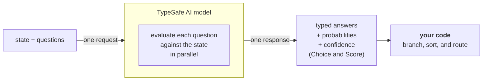

Jev 是 TypeSafe 的旗舰模型，也是第一个 System One 模型。发送 state 与类型化问题，即可得到代码可直接使用的结构化答案。

大语言模型（LLM）是为人类阅读而生成文本的。当你需要模型做出一个**由代码消费的判断**时，错配就出现了：你在把一个文本生成系统硬掰成结构化决策器，再把结果解析回代码能依赖的东西。

Jev 是 TypeSafe 的旗舰模型，也是第一个 [System One 模型](https://docs.typesafe.ai/concepts/system-one)。System One 模型专为**快速、结构化、软件可直接使用**的决策而训练。Jev 针对 `state` 评估类型化问题，并直接返回结构化结果。没有文本生成，没有解析。你得到的是类型化取值与概率分布，代码可以据此分支、排序与路由。Choice 与 Score 还会返回 [confidence](https://docs.typesafe.ai/confidence)，代码可用它来决定是否以及如何对答案采取行动。

## TypeSafe 原语

TypeSafe 暴露三个 **AI 原语（AI primitive）**。与软件原语类似，我们的 AI 原语模块化、可组合、结构化、可靠且快速。每个原语提出一种不同类型的问题，并返回一种不同类型的答案。

| 问题类型 | 目标 | 返回 |
| --- | --- | --- |
| [Choice](https://docs.typesafe.ai/primitives/choice) | 从列表中选一个选项 | `choice`、`probabilities`、`confidence` |
| [Score](https://docs.typesafe.ai/primitives/score) | 按评分表给状态打分 | `score`、`probabilities`、`confidence` |
| [Noul](https://docs.typesafe.ai/primitives/noul) | 这个陈述是否为真？ | `noul`（0–1） |

三种问题类型可以混在同一次 API 调用里。每个问题都在一次请求中针对同一个 `state` 并行、独立地求值。增加问题几乎不会改变响应时间。每个问题独立求值，因此增加更多问题不会产生上下文腐化（context-rot）。

## 原子化问题，在代码中组合

System One 模型在「每个问题只问一件具体、范围明确的事」时效果最好。把每个问题想成一次直觉判断：那种在给定正确上下文后，一个知识渊博的人几秒钟就能做出的判断。

如果你要问的问题需要长篇推理，或要权衡多个独立因素，那就把它拆解。把每个因素作为单独的问题提出，再用你代码里的逻辑组合结果。这能让每一次独立求值都保持可靠，并让你完全掌控各维度的加权方式。

例如，与其问『给这个创业路演打分』，不如分别问市场规模、技术可行性与差异化，再用你自己的公式组合分数。当优先级变化时，改代码里的一个系数，而不是重写一段提示词。

## 后续步骤

- [快速开始](https://docs.typesafe.ai/introduction/quickstart) — 立即上手所需的一切。
- [AI 入门](https://docs.typesafe.ai/introduction/machine-learning-primer) — 为什么 TypeSafe 训练用于校准决策的模型，而非生成文本。
- [原语（问题）](https://docs.typesafe.ai/primitives) — 如何定义问题、在 Choice、Score、Noul 之间选择，并一次提出多个。
- [置信度](https://docs.typesafe.ai/confidence) — TypeSafe 如何报告确定性，以及如何在架构上使用它。
- [模式](https://docs.typesafe.ai/patterns) — 用 TypeSafe 构建系统的常见模式。
