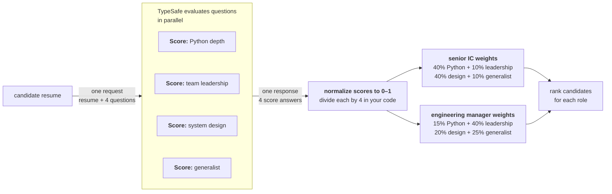

我们常常想基于多个标准同时对一组条目排序。复合评分是一种简单的思路：把判断拆成相互独立的维度，分别给每个维度打分，再用你在代码中控制的权重把它们合并。

## 示例：简历筛选

设想你在为工程岗位处理简历。你想基于多个标准对候选人排序，最终挑出前 X 名进入进一步审核。



### 第一步：独立地为每个维度打分

```jsx
<TypesafeExample
  title="questions"
  display="questions"
  example={{
questions: {
  python_depth: {
    type: 'score',
    instructions:
      'How much depth of python experience does this candidate have, based on the supplied resume?',
    criteria: [
      'No Python experience mentioned',
      'Mentioned but no detail',
      'Used in projects, some specifics',
      'Primary language, multiple projects',
      'Deep expertise: architecture, performance, libraries',
    ],
  },
  team_leadership: {
    type: 'score',
    instructions:
      'How much experience does this candidate have managing or leading engineering teams?',
    criteria: [
      'No management experience mentioned',
      'Informal mentorship or tech lead role',
      'Led a small team or project',
      'Managed a team with direct reports',
      'Managed multiple teams or an engineering org',
    ],
  },
  system_design: {
    type: 'score',
    instructions:
      'How much experience does this candidate have designing large-scale or distributed systems?',
    criteria: [
      'No architecture work mentioned',
      'Contributed to design discussions',
      'Designed components of a larger system',
      'Owned architecture of a significant system',
      'Designed systems at scale across multiple domains',
    ],
  },
  generalist: {
    type: 'score',
    instructions:
      'How much evidence is there that this candidate picks up unfamiliar tools, roles, or domains outside their core specialty?',
    criteria: [
      'Only one domain or role mentioned',
      'Some variety but within a narrow field',
      'Worked across a few different areas or tech stacks',
      'Regularly moved between domains, wore many hats',
      'Track record of ramping up in unfamiliar areas and delivering',
    ],
  },
},
}}
/>
```

### 第二步：用权重合并

每个维度都被归一化到 0–1 并赋以权重。权重让你能轻松调整每个维度的相对重要性，同时不丢失各分数的任何细微差异。

```python
py      = response.answers["python_depth"].score / 4
lead    = response.answers["team_leadership"].score / 4
arch    = response.answers["system_design"].score / 4
general = response.answers["generalist"].score / 4

# Senior IC
ic_score = (0.40 * py) + (0.10 * lead) + (0.40 * arch) + (0.10 * general)

# Engineering Manager
em_score = (0.15 * py) + (0.40 * lead) + (0.20 * arch) + (0.25 * general)
```

这让你能按复合评分对候选人排序。但更重要的是，它让你看清最终评分究竟是如何算出来的。如果排名最高的候选人与你的预期不符，你可以调整权重来找到合适的平衡。
