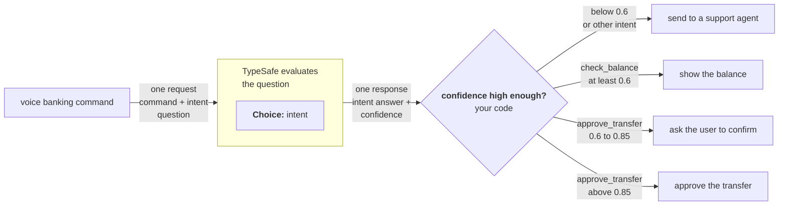

TypeSafe 最强大的特性之一是 [置信度](https://docs.typesafe.ai/confidence)。只要你有意识地用 confidence 来门控决策，就能构建既可靠又安全的系统。

## 示例：语音银行指令

设想你在构建一个语音银行界面，让用户通过语音与账户交互。虽然你总希望能合理把握对用户意图的理解，但某些操作风险更高，因此要求更高的置信度阈值。



### 第一步：确定用户意图

```jsx
<TypesafeExample
  title="questions"
  display="questions"
  example={{
questions: {
  intent: {
    type: 'choice',
    instructions: 'What action is the user requesting?',
    criteria: {
      check_balance: 'Check the balance of an account',
      approve_transfer: 'Approve the pending transfer request',
      other: 'Something else',
    },
  },
},
}}
/>
```

### 第二步：置信度门控路由

```python
action = response.answers["intent"]

# Below 0.6 confidence on any action, route to a human
if action.confidence < 0.6:
    route_to_support_agent(account_id)

elif action.choice == "check_balance":
    # Low stakes. 0.6 confidence is sufficient.
    show_balance(account_id)

elif action.choice == "approve_transfer":
    if action.confidence > 0.85:
        # High stakes, but high confidence. Safe to act automatically.
        approve_transfer(account_id)
    else:
        # High stakes, moderate confidence. Verify intent first.
        ask_user_to_confirm("Just to confirm: you would like to approve this transfer, is that correct?")

else:
    route_to_support_agent(account_id)
```

0.6 这个下限能兜住模型真正不确定的任何情况。超过这个下限后，每种操作类型都有自己的阈值，取决于「分错类」的后果。以 0.6 查余额没问题，因为最坏情况不过是用户多听一段余额播报。但批准转账需要非常高的置信度（>0.85），否则系统应请用户确认。

关于如何在系统中思考置信度，更多细节参见 [置信度](https://docs.typesafe.ai/confidence)。
