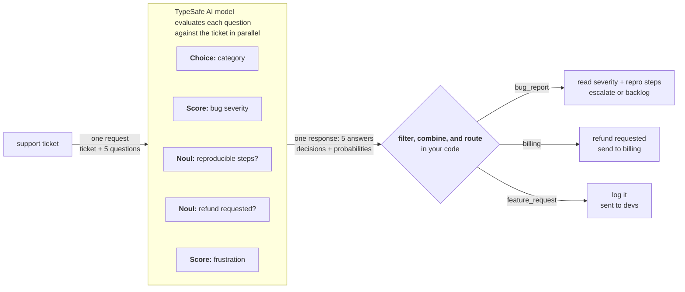

由于 TypeSafe 支持在单次 API 调用中发送多个问题，我们建议把系统需要的所有问题都放进一次请求，事后再用代码决定哪些相关。所有问题都是并行评估的，所以增加更多问题通常对响应时间影响很小。

## 示例：工单分诊

设想你在构建一个需要分诊工单的支持系统。你需要把工单归类到一个类别。如果是 bug 报告，你还要确定 bug 的严重程度。

与其先问类别、再在后续调用里问严重程度，你可以同时问两者。如果工单不是 bug 报告，你直接忽略 bug 严重程度问题的结果即可。



### 第一步：推测式扇出

```jsx
<TypesafeExample
  title="questions"
  display="questions"
  example={{
state:
  "Hi, I placed an order (#98423) last Thursday and was charged twice. I also can't log in after the site update, and adding Apple Pay would be really helpful. This is getting frustrating.",
questions: {
  category: {
    type: 'choice',
    instructions: 'Determine the broad category of this support ticket',
    criteria: {
      bug_report:
        'The user is reporting something that is broken or producing errors',
      billing: 'Charges, invoices, refunds, subscriptions',
      feature_request: 'The user is requesting new functionality',
      account: 'Login, permissions, profile, security',
    },
  },
  bug_severity: {
    type: 'score',
    instructions: 'How severe is the reported issue',
    criteria: [
      'Cosmetic; no impact to functionality',
      'Broken or degraded feature; workaround exists',
      'Blocking issue; no workaround exists',
    ],
  },
  has_reproducible_steps: {
    type: 'noul',
    instructions:
      'The user describes specific steps to reproduce the issue',
  },
  refund_requested: {
    type: 'noul',
    instructions: 'The user is explicitly asking for a refund or credit',
  },
  frustration: {
    type: 'score',
    instructions: 'How frustrated the user appears',
    criteria: ['Calm, matter-of-fact', 'Frustrated but civil', 'Very angry'],
  },
},
}}
/>
```

> **提示：** 推测性问题：`bug_severity` 和 `has_reproducible_steps` 只有在工单是 bug 报告时才有意义；`refund_requested` 只在 billing（账单）场景下有意义。我们之所以一次性全放进去，是因为增加问题通常对响应时间影响很小。如果工单最终是 feature request（功能请求），bug 严重程度的结果就无关紧要，此时你的代码路径直接忽略它即可。

### 第二步：用代码路由

你的代码根据分类结果决定哪些相关：

```python
category = response.answers["category"]
bug_severity = response.answers["bug_severity"]
bug_repro = response.answers["has_reproducible_steps"]
refund = response.answers["refund_requested"]
frustration = response.answers["frustration"]

if category.choice == "bug_report":
    if bug_severity.score > 1.5 and bug_repro.noul > 0.6:
        escalate_to_engineering(ticket_id, severity="high")
    else:
        add_to_bug_backlog(ticket_id)

elif category.choice == "billing":
    if refund.noul > 0.7:
        route_to_billing_with_flag(ticket_id, refund_likely=True)
    else:
        route_to_billing(ticket_id)

elif category.choice == "feature_request":
    log_feature_request(ticket_id)

# Frustration is useful regardless of category
if frustration.score > 1.5:
    flag_for_priority_response(ticket_id)
```

完整决策树所需的全部信息都来自一次调用。推测性问题在无关时被忽略，在相关时省去了一轮往返。
