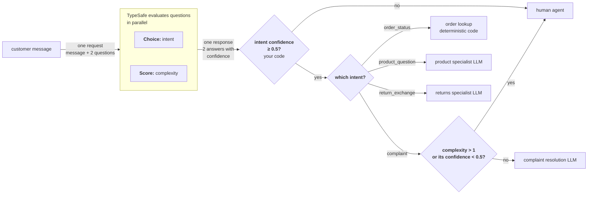

并非每个用户请求都需要同类处理程序。有些用数据库查询就能回答；有些需要带领域上下文的 LLM；有些需要人工。TypeSafe 可以站在所有这些之前，作为一个快速、廉价的分类器，决定调用哪个处理程序。

## 示例：客服路由

设想你在构建一个客服系统。消息进来后需要路由到正确的处理程序。与其把每条消息都丢进昂贵的 LLM 去判断它是什么类型的请求，不如先分类、再相应路由。



### 第一步：分类意图与复杂度

```jsx
<TypesafeExample
  title="questions"
  display="questions"
  example={{
questions: {
  intent: {
    type: 'choice',
    instructions: 'The primary intent of this customer message',
    criteria: {
      order_status: 'Asking about an existing order',
      product_question: 'Asking about a product before buying',
      return_exchange: 'Wants to return or exchange something',
      complaint: 'Unhappy with experience, wants resolution',
    },
  },
  complexity: {
    type: 'score',
    instructions: 'How complex is this request to resolve',
    criteria: [
      'Simple lookup or standard procedure',
      'Requires some judgment or multi-step process',
      'Unusual situation, edge case, or escalation needed',
    ],
  },
},
}}
/>
```

### 第二步：路由到最优处理程序

```python
def route_ticket(ticket_id, response):
    intent = response.answers["intent"]
    complexity = response.answers["complexity"]

    if intent.confidence < 0.5:
        # If we don't have enough confidence to classify, route to a human agent
        return route_to_human_agent(ticket_id)

    if intent.choice == "order_status":
        handle_order_status(ticket_id)

    elif intent.choice == "product_question":
        handle_with_llm(ticket_id, PRODUCT_SPECIALIST)

    elif intent.choice == "return_exchange":
        handle_with_llm(ticket_id, RETURNS_SPECIALIST)

    elif intent.choice == "complaint":
        low_confidence = complexity.confidence < 0.5
        # A higher complexity.score leans toward the "escalation needed" end of the scale.
        if complexity.score > 1 or low_confidence:
            # Too complex for safe automation, or we're not sure about the complexity; route to a human.
            route_to_human_agent(ticket_id)
        else:
            handle_with_llm(ticket_id, COMPLAINT_RESOLUTION)
```

一个意图路由到不涉及 LLM 的确定性代码；两个路由到不同的专用 LLM，各自加载不同上下文；一个用 complexity（复杂度）分数在 LLM 与人工之间做选择。TypeSafe 在一次性快速调用中完成分类；昂贵的资源只在真正需要的请求上才被调用。

注意对 complexity 分数额外做的 confidence 检查。如 [置信度](https://docs.typesafe.ai/confidence) 中所述，在系统上下文与决策风险下思考低置信度分数的含义，始终很重要。
